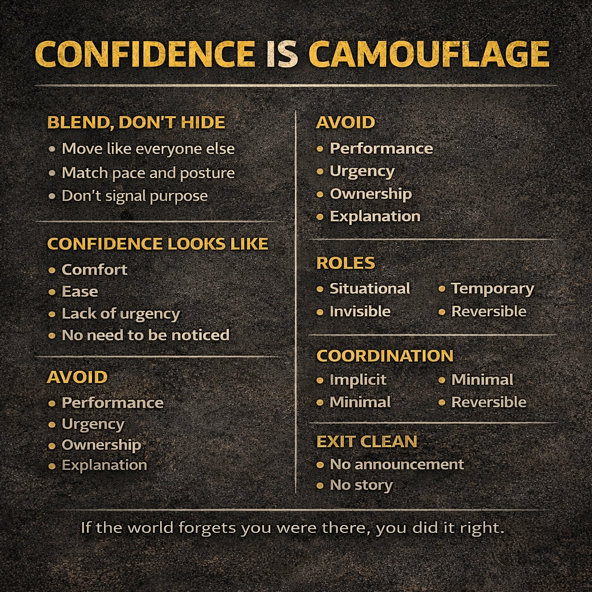
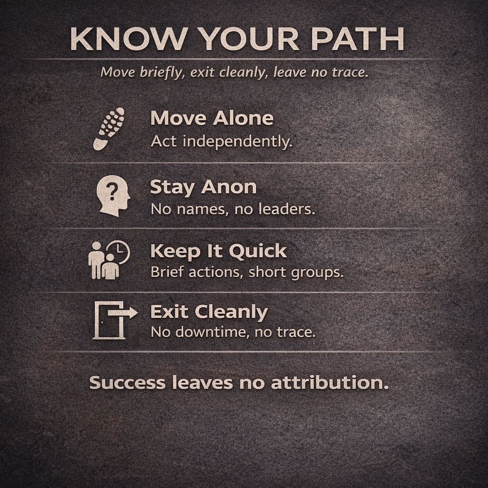
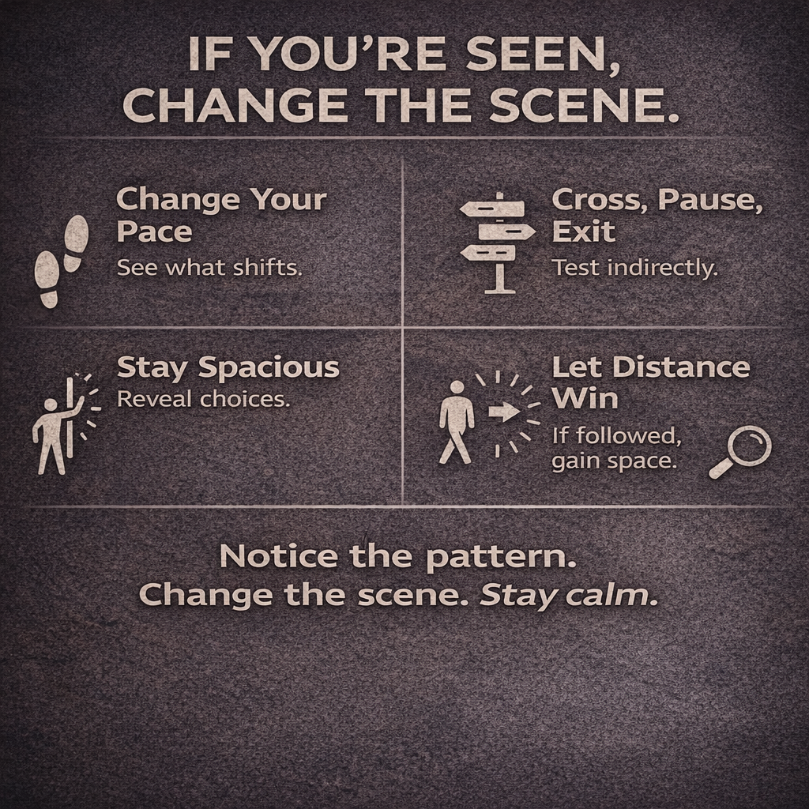
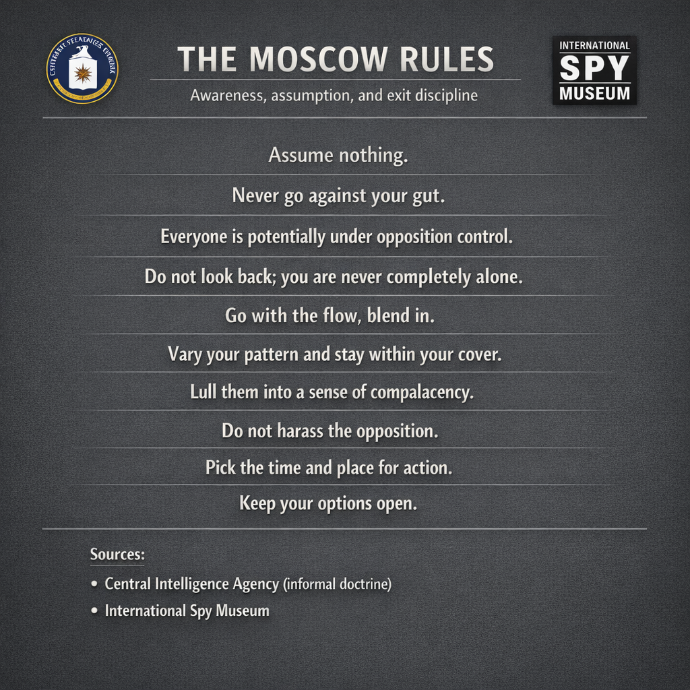
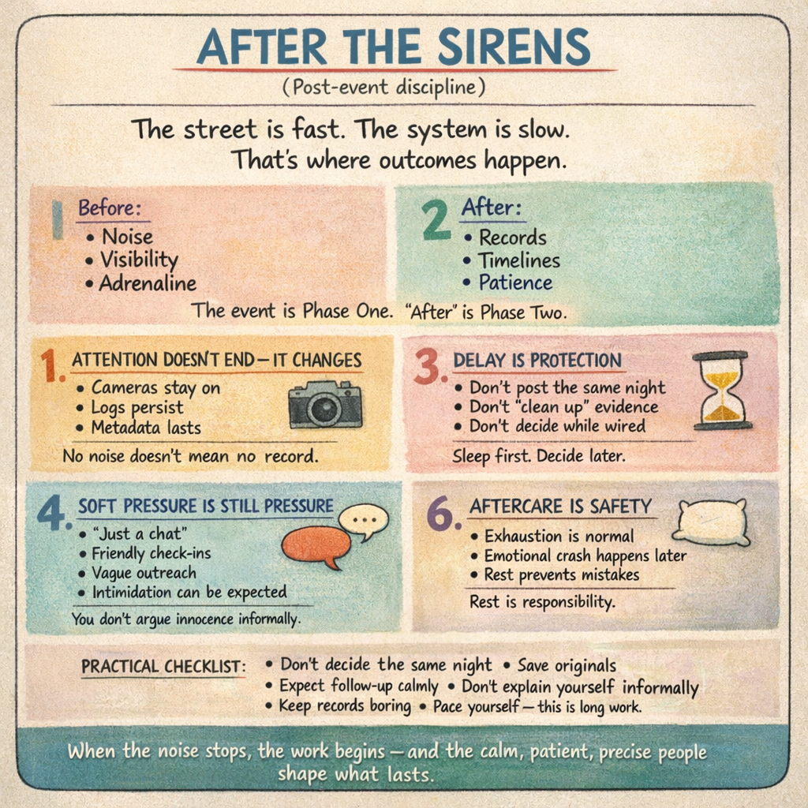
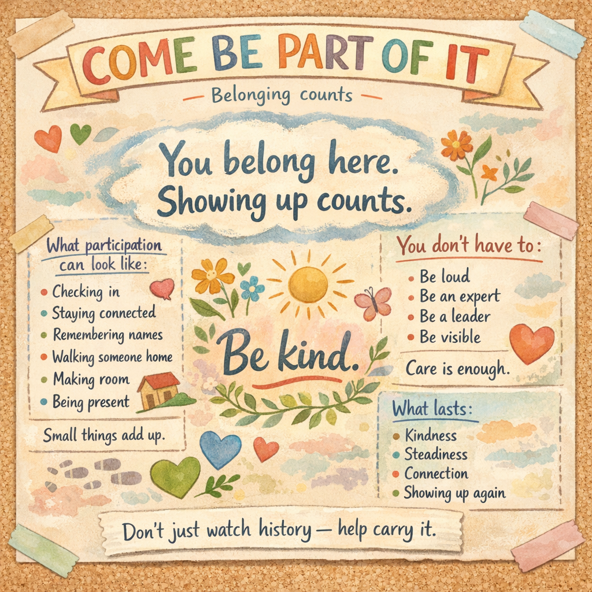

# Civic Readiness & Digital Hygiene

\newpage

# Civic Readiness &  Digital Hygiene

## Album Syllabus / Curriculum Aid

---

## Purpose

This curriculum teaches **calm, lawful, sustainable civic participation** in a digitally saturated environment. It prioritizes **restraint, safety, continuity, and memory** over urgency or spectacle.

This is **not** an instruction set for confrontation. It is a framework for **showing up clean, staying human, and going home intact**.

---

## How to Use This Album

- You do **not** need to listen in order every time.
- Different tracks serve different moments.
- Repetition is intentional.
- Calm is the goal.

Think of this album as a **field guide in musical form**.

---

## Module 0 — Orientation (Listen Once)

**Purpose:** Establish mindset

1. Make the Phone Boring
2. Say It Slow

**Outcome:**

You understand that **pace, silence, and preparation are forms of control**.

---

## Module 1 — Before You Go (Pre‑Event Discipline)

**Purpose:** Reduce risk before anything happens

3. Confidence Is Camouflage
4. Carry the Signal
5. Allowed to Rest

**Key doctrines learned**

- Personal phone stays home
- Action phone shows up clean
- PIN over biometrics
- No cloud sync
- No borrowed power
- Fewer signals, fewer problems

**Outcome:**

You arrive **digitally uninteresting**.

---

## Module 2 — Crowd Dynamics & Safety

**Purpose:** Stay safe without escalation

6. Stay Upright
7. Big Tent Weather
8. Escalation Is a Tell
9. When It’s Needed
10. Know Your Path
11. If It Breaks, Walk Away

**Key doctrines learned**

- Crowd compression awareness
- Coalition cohesion without hierarchy
- Pressure and urgency as warning signs
- Role‑appropriate contribution without ownership
- Disengagement and exit as success

**Outcome:**

You know **when to slow, when to help, and when to leave**.

---

## Module 3 — Observation & Awareness

**Purpose:** See clearly without becoming visible

12. SALUTE
13. If You’re Seen, Change the Scene
14. Confidence Is Camouflage (Reinforcement)

**Key doctrines learned**

- Observation without fixation
- Pattern recognition
- Adaptation without panic

**Outcome:**

You gather context without creating targets.

---

## Module 4 — Rights, Law, & Ethical Boundaries

**Purpose:** Maintain legal footing and moral agency

15. Am I Detained or Am I Free
16. The Moscow Rules
17. Duty to Disobey
18. TPM
19. Love, Power, War

**Key doctrines learned**

- Silence as a right
- Law above orders
- Ethical refusal of unlawful commands
- Time‑place‑manner boundaries
- Power, legitimacy, and moral forces

**Outcome:**

You protect yourself **without antagonizing authority** while understanding how restraint preserves legitimacy.

---

## Module 5 — Media & Evidence Discipline

**Purpose:** Preserve truth without self‑inflicted harm

20. Save the Original
21. After the Sirens
22. We Don’t Forget

**Key doctrines learned**

- Evidence integrity
- Metadata preservation
- Delayed publication discipline

**Outcome:**

You do not undermine credibility through haste.

---

## Module 6 — Aftercare & Continuity

**Purpose:** Make participation sustainable

23. Court Is Quiet Work
24. No One Goes Alone
25. Come Be Part of It
26. Allowed to Rest (Reinforcement)

**Key doctrines learned**

- Mutual aid as routine
- Court accompaniment
- Re‑entry without pressure
- Long‑tail care and rest

**Outcome:**

People are **still okay weeks later**.

---

## Module 7 — Exit, Endurance, & Closure

**Purpose:** Leave cleanly and reinforce continuity

27. If It Breaks, Walk Away (Reinforcement)
28. What Lasts

**Key doctrines learned**

- Leaving early is success
- Endurance over spectacle

**Outcome:**

You exit without carrying damage forward.

---

## Who This Is For

- Participants
- Organizers
- Support crews
- First‑timers
- Observers
- Anyone who wants to help without becoming a liability

---

## What This Curriculum Does Not Do

- It does not encourage confrontation
- It does not provide tactical instructions
- It does not promote secrecy or evasion
- It does not valorize risk

It teaches **discipline, care, and continuity**.

---

## Core Principles (Memory Hooks)

- Speed removes choice
- Silence is a skill
- Boring devices stay safe
- Pressure is a tell
- Leaving is allowed
- Support lasts longer than moments

---

## Status

- All doctrine complete
- All gaps closed
- Clausewitz framework integrated
- Crowd role doctrine integrated
- Continuity and re‑entry doctrine integrated
- Civic‑safe
- EFF/ACLU‑aligned
- Ready for distribution

---

*Release links can be added per track when available.*

\newpage

# 🎧 About the Artist / Liner Notes

## 🗂️ Project Title: *Civic Readiness & Digital Hygiene*  
**🎙️ Artist / Facilitator:** `ThirtySevenFox`

---

## 👤 About the Creator

Veteran of the security industry and former U.S. Army soldier — before a non-service-related injury hit the brakes.

These days, `ThirtySevenFox` splits time between a major tech company and private crisis management consulting for individuals, orgs, and governments that find themselves in the deep end. Routinely traveling to hot spots internationally to clear their sinuses with tear gas.

A long-time believer in **"train the trainer"** models, most work focuses on equipping others to stay upright when the system tilts sideways.

> 💬 **Yes**, strong political opinions exist.  
> 💬 **No**, they’re not in this project.  
> **Intentional effort** was made to keep this work **non-partisan**, **non-denominational**, and **painfully practical**.

---

## 🛠️ About the Production

Social media loves to shout:  
**“It’s a PSYOP!”**  
**“It’s AI!”**  
Anytime something well-produced hits their feed.

> 🎯 In this case? It’s both.

Built using U.S. Army influence doctrine (`FM 33.1-1`) and powered by multiple AI tools:
- `OpenAI`
- `Perplexity`
- `Anthropic`
- `Suno`

This project compresses what would normally take a **team** of planners, artists, musicians, editors, and ops personnel **months** — into about **a week of solo workflow** with machine collaboration.

> ❌ Is it perfect? No.  
> ✅ Is it timely? Absolutely.

---

### 🤖 AI Usage Disclosure:

AI was used the way it *should* be:  
**As a tool. Not a replacement.**

It contributed to:
- Lyric metering
- Lesson plan generation
- Document editing and formatting
- Infographic creation
- Music arrangement

No bots pretended to care. They just helped build faster.  
And that’s the point.

---

## 🙏 Acknowledgment

Thanks to the toolmakers who unknowingly enabled a full-spectrum civic education drop with:
- ⚡ Accelerated timeline
- 📦 Decent quality
- 🧠 Tactical depth

---

**Need this adapted or need to discuss:**  
- Press Engagement
- Distribution
- Education Opportunities
- Zines  
- Presentations
- Speaking Engagements
- Crisis Consulting
- Collaboration

Let’s talk.
mail: civics@mctsecurity.com

### 🎶 About the Music

Musical genre and style were chosen for **memorability**, not because they’re groundbreaking. You’re not getting chart-toppers — you’re getting **Yacht Rock mnemonics** and **Boy Band ACLU crib sheets**.

> 📝 *If it’s catchy enough to annoy you, it’s probably sticky enough to save your rights.*

This isn’t about cool. It’s about **recall under pressure**. Earworms win.

> 🎧 **That said... this *did* produce some bangers.**

\newpage

# PRESS KIT

## Civic Readiness & Digital Hygiene 

*A public education project by ThirtySevenFox*

------

## Executive Summary (TL;DR)

**Civic Readiness & Digital Hygiene** is a public-facing educational project that uses **music, infographics, and plain-language lessons** to teach lawful, calm, and sustainable civic participation in a modern surveillance and media environment.

The project emphasizes:

- restraint over reaction
- care over confrontation
- legality over escalation
- continuity over spectacle

It is **explicitly non-violent**, **non-tactical**, and **non-partisan**.

------

## What This Project Is

- A **24-track educational album** paired with a **public curriculum**
- A translation of established civil-liberties, media-ethics, and civic-safety guidance into **memorable, accessible formats**
- A toolkit for **ordinary people**, not activists or professionals
- Designed for audiences **ages 15–90**

Music is used because it:

- is repeatable
- is easier to remember under stress
- crosses literacy, age, and cultural boundaries

------

## What This Project Is Not

This project is **not**:

- a protest-organizing manual
- a tactical or operational guide
- a call to action
- training in evasion, disruption, or confrontation
- aligned with any political party or ideology

It does **not** instruct people how to:

- break laws
- resist lawful orders
- avoid accountability
- engage in violence or disruption

------

## Why It Exists

Modern civic participation carries **real risks**, often unintentionally created by:

- smartphones and cloud platforms
- social media amplification
- misunderstanding of rights
- burnout after high-stress events
- poor evidence handling
- pressure to escalate or “do something now”

Most people only learn these lessons **after harm occurs**.

This project focuses on **prevention, legitimacy, and aftercare**.

------

## Core Principles

> **Safety, legality, and care matter more than speed or spectacle.**

Key ideas repeated across the curriculum:

- slower pace preserves choice
- silence is lawful
- digital restraint protects people
- escalation is a warning sign
- leaving early can be success
- aftercare is real work
- memory outlasts outrage

------

## Curriculum Overview (24 Tracks)

The curriculum is structured into **six modules**, each with lesson plans derived from the lyrics.

### Module 1 — Digital Hygiene

- *Make the Phone Boring*
- *Say It Slow*
- *Save the Original*

Focus: minimizing digital risk, evidence discipline, restraint.

------

### Module 2 — Presence & Awareness

- *Walk Like You Belong*
- *If You’re Seen, Change the Scene*
- *Confidence Is Camouflage*

Focus: situational awareness without paranoia or confrontation.

------

### Module 3 — Crowd Dynamics & Safety

- *Stay Upright*
- *When It’s Needed*
- *Know Your Path*

Focus: crowd safety, role clarity, de-escalation, and disengagement.

------

### Module 4 — Rights, Law & Ethical Boundaries

- *Am I Detained or Am I Free?*
- *TPM (Time, Place, Manner)*
- *Duty to Disobey*
- *Love, Power, War*

Focus: First Amendment doctrine, lawful refusal, ethics, and responsibility.

Sources include **ACLU Know Your Rights**, constitutional law, and professional ethics frameworks.

------

### Module 5 — Pressure, Provocation & Discipline

- *Escalation Is a Tell*
- *If It Breaks, Walk Away*
- *The Moscow Rules*

Focus: recognizing pressure, provocateurs, infiltration behaviors, and clean disengagement.

------

### Module 6 — Aftercare & Continuity

- *After the Sirens*
- *Court Is Quiet Work*
- *We Don’t Forget (But We Don’t Burn)*
- *No One Goes Alone*
- *Allowed to Rest*
- *Come Be Part of It*

Focus: after-event care, legal follow-through, memory, rest, and sustained civic health.

------

## Standards & Sources

The project is informed by:

- ACLU **Know Your Rights** materials
- First Amendment **Time, Place, and Manner** doctrine
- Media ethics and evidence-handling best practices
- Crowd-safety and de-escalation principles
- Military and law-enforcement ethics (e.g., duty to refuse unlawful orders)
- Historical doctrine (e.g., Clausewitz, “Moscow Rules” as tradecraft metaphors)

All references are **public, lawful, and educational**.

------

## Intended Audience

- Members of the general public
- First-time civic participants
- Support volunteers
- Educators and trainers
- Families and community groups

Participation is **voluntary**. No affiliation required.

------

## Tone & Safeguards

- Calm, non-provocative language
- No calls for urgency or escalation
- No instruction to evade law enforcement
- No operational or tactical instruction
- Explicit emphasis on legality and restraint

------

## Release & Distribution

- Music distributed via standard platforms (DistroKid)
- Curriculum hosted publicly (GitHub / static site)
- Visual infographics platform-safe
- Press materials available openly

------

## One-Sentence Description for Press

> *A civic education project that teaches people how to show up safely, lawfully, and sustainably in a digital age—using music instead of manuals.*

------

## Contact & Materials

- **Artist / Project:** ThirtySevenFox
- **Curriculum Repository:** GitHub (public)

- **Press Assets:** lyrics, lesson plans, infographics available on request

\newpage

# Make the Phone Boring

**Artist:** ThirtySevenFox

---

### Verse 1 — Framing

Phones are smart
But not your spine
Not the place
For every line

If it thinks
So you don't have to
That's when it
Starts choosing for you

Before the door
Before the sound
Decide what comes
Along around

### Pre-Chorus

If it does more
Than it needs to do
That's one more thing
Controlling you

### Chorus — Core Rule

*Make the phone boring
Make it plain
No little glow
Calling your name*

*If it doesn't help
Leave it behind
Quiet is a kind
Of mind*

*Make the phone boring
Lock it down
Nothing to see
Nothing around*

*You're not hiding
You're just clean
You don't owe
Every screen*

---

### Verse 2 — Device Separation

One phone carries
Your whole life
Every habit
Every night

That one stays home
That one stays known
It doesn't need
To walk this road

Another phone
For showing up
No past to pull
No life to touch

It knows today
And not before
That's all it's for
That's all it's for

### Pre-Chorus 2

When lives mix
Risk spreads wide
Clean lines
Keep sides inside

### Chorus — Reinforced

*Make the phone boring
Make it small
One job only
Nothing more*

*What you live
Stays where you are
What you bring
Doesn't know your heart*

---

### Verse 3 — Sync & Exhaust

Every tap
Goes somewhere else
Copies made
You never felt

Clouds don't ask
If now's the time
They just keep
Every line

Even still
It talks away
Logging things
You didn't say

The less it knows
The less it sends
Silence travels
Farther then

---

### Verse 4 — Input Risk

Even trusted apps
Sit on keys
Guess your words
Before you mean

Hands move fast
The screen remembers
More than just
What you enter

If it matters
Say it slow
Or ask if
It needs to go

---

### Verse 5 — Cables & Power

Outlet hums
By the wall
Cables offered
Like a call

Waiting rooms
Airport rows
Power that
You don't quite know

If you didn't
Bring the wire
Don't accept
The borrowed fire

Some things charge
More than a phone
Some things shouldn't
Touch your own

---

### Bridge — Silence & Refusal

Power talks
Even when you don't
Silence means
You said no

Later works
Just as well
Nothing breaks
If you don't plug in

---

### Verse 6 — Biometrics

Fingers answer
Faster than thought
Faces open
What words would not

Speed feels easy
Till it's not
Memory waits
Muscle won't

If it opens
Just by being you
That's one thing
You didn't choose

Let it ask
Let it wait
Slow is still
A kind of gate

---

### Verse 7 — Memory

Phones are smart
But not your ground
They can die
Or not be found

Numbers worth
Your peace of mind
Live in you
Not all online

Say them through
Write them once
Legal help
Knows how to find you

Memory's the backup
You control
When the screen
Won't play its role

---

### Verse 8 — Aftercare

When you're home
And lights are low
There's still some care
You need to show

Change the locks
You can't see
Close the doors
Quietly

Nothing rushed
Nothing loud
Just clean it up
When you're allowed

---

### Final Chorus — Lock-In

*Make the phone boring
Before you go
The less it does
The more you know*

*If it mattered
You would know
If it didn't
Let it go*

*Make the phone boring
Black and still
Nothing arguing
With your will*

*You're not hiding
You're not wrong
You're just keeping
Lines strong*

---

### Outro — Mantra

Before the street
Before the sound
Make the quiet
Stick around

**Make it boring.**

\newpage

# Lesson Detail — Make the Phone Boring

| | |
|---|---|
| **Module** | 1 — Before You Go (Pre-Event Discipline) |
| **Track Type** | Core doctrine (digital hygiene, autonomy, restraint) |
| **Duration** | One listen (repeatable) |
| **Audience** | General public, first-time participants, support roles |

## Lesson Purpose

To teach digital restraint and device discipline as a form of personal safety, autonomy, and credibility preservation.

This lesson establishes that phones are powerful tools but poor decision-makers, and that reducing their role before entering public space preserves choice, calm, and control.

## Core Doctrine

> A phone should assist you — not decide for you.

**Safety increases when devices:**
- Do less
- Pause before acting
- Require intention
- Remain forgettable

**Risk increases when devices:**
- Anticipate behavior
- Remove friction
- Merge identities
- Act automatically
- Accept unknown inputs

## Learning Objectives

By the end of this lesson, participants should be able to:

1. Explain why making a phone boring increases safety
2. Understand why delay is a protective feature
3. Describe the importance of PINs over biometrics
4. Apply device separation correctly
5. Recognize risks from sync, input, and power
6. Accept waiting and refusal as competent choices

## Key Concepts (Plain Language)

### 1. Phones Are Smart — But Not Your Spine

Phones optimize for:
- Speed
- Convenience
- Reduced effort

These features are useful — until they remove decision points that matter in public space.

> If a device thinks so you don't have to, it is already choosing for you.

The goal is not to reject technology, but to retain agency.

### 2. Make the Phone Boring

A boring phone:
- Performs one job
- Attracts no attention
- Makes no assumptions
- Asks before acting

Boring means:
- No unnecessary apps
- No glowing prompts
- No background activity you didn't choose

> Quiet is a kind of mind.

### 3. Delay Preserves Choice (PIN vs Biometrics)

Biometric access is designed for speed.

**Biometrics:**
- Unlock immediately
- Respond to physical presence
- Cannot hesitate
- Cannot refuse

**Knowledge-based access (PINs):**
- Introduces delay
- Requires intention
- Creates a pause
- Preserves choice

> Delay is not inconvenience — delay is control.

When a device pauses for a PIN:
- You can think
- You can wait
- You can refuse

When a device unlocks by recognizing your body, the decision is already made.

> Choosing a PIN is choosing intentional friction.

### 4. Device Separation

**Personal phone:**
- Holds identity
- History
- Habits
- Relationships

*This device stays home.*

**Action phone:**
- Has no past
- No personal accounts
- No cloud identity
- One limited purpose

> When lives mix, risk spreads. Clean lines keep sides inside.

### 5. Sync, Exhaust, and Invisible Copies

Every interaction creates:
- Metadata
- Logs
- Replicas elsewhere

Cloud systems:
- Do not ask timing
- Do not know context
- Do not forget

> The less a device knows, the less it can send.

### 6. Input Risk (Keyboards, Prediction, Logging)

Even trusted systems:
- Observe inputs
- Predict intent
- Retain patterns

This includes:
- Keyboards
- Autofill
- Predictive text
- Background analytics

If something matters:
- Slow down
- Or decide it doesn't need to be entered

### 7. Power, Cables, and Physical Access

> Power is not neutral.

Unknown or shared chargers, power adapters, cables, and ports can:
- Copy data
- Introduce malware
- Exploit device vulnerabilities
- Alter device behavior
- Damage hardware or software integrity

> Power and data often travel together.

If you did not bring the cable, you do not use the outlet.

> Some things charge more than a phone.

Refusal is not confrontation. Delay is not failure.

### 8. Memory as Backup

Phones can be:
- Lost
- Taken
- Damaged
- Compromised

Critical information should live:
- In memory
- On paper kept elsewhere
- With trusted people

Examples:
- Emergency contacts
- Legal aid numbers

> Memory is the backup you control.

### 9. Aftercare and Quiet Cleanup

Risk does not end when you leave.

After returning home:
- Review access
- Change credentials if needed
- Reduce permissions
- Update devices deliberately
- Act without urgency

> Nothing rushed. Nothing loud.

## Teaching Notes (Facilitator)

- Emphasize preparation over fear
- Avoid technical deep dives
- Frame delay and refusal as competence
- Reinforce that friction protects choice

This lesson works best when framed as:

> "Reduce what the device can do before it decides for you."

## Common Misconceptions to Address

- "It's just power, not data"
- "Convenience is harmless"
- "Speed equals safety"
- "If I'm not doing anything wrong, it doesn't matter"

**Reframe gently:** Unknown systems introduce unknown outcomes.

## Indicators of Understanding

A participant understands the lesson when they can say:

- "My personal phone stays home."
- "This phone does one thing."
- "Delay gives me control."
- "If I didn't bring the cable, I don't use it."

## Relationship to Other Tracks

| Track | Connection |
|-------|------------|
| Say It Slow | Speech restraint and delay |
| Walk Like You Belong | Behavioral blending |
| Escalation Is a Tell | Pressure recognition |
| Save the Original | Post-event discipline |

This track anchors digital autonomy and hygiene doctrine across the curriculum.

## One-Sentence Summary (Memory Hook)

> **The less your phone decides, the more control you keep.**

\newpage

\newpage

# Say It Slow

**Artist:** ThirtySevenFox

---

### Verse 1 — Personal

You don't owe the room your every thought
Silence isn't weakness, it's a knot
Tied tight, keeps your options wide
Once it's out, it's out — can't rewind

Every word's a door you open wide
You don't know who's standing on the other side
You can add another line later on
But you can't pull a sentence once it's gone

### Pre-Chorus

Take a breath
Feel the space
Let the moment
Set the pace

### Chorus

*Say it slow
Say just enough
You can always add
But you can't take it back*

*Say it clean
Say it light
What you don't say
Stays yours tonight*

*You can always say more
You can never say less
So pause before
You cross that edge*

---

### Verse 2 — Digital

Every text is permanent ink
Every post is faster than you think
Screenshots live longer than you know
Even when the original goes

Context fades but copies stay
Tone gets lost along the way
You don't control where words will land
Once they leave your hand

### Pre-Chorus

Take the beat
Let it pass
Silence buys you
Time to ask

### Chorus

*Say it slow
Say just enough
You can always add
But you can't take it back*

*Say it clean
Say it light
What you don't say
Stays yours tonight*

*You can always say more
You can never say less
So pause before
You cross that edge*

---

### Bridge

Not every moment
Needs a reply
Not every truth
Needs your side

Silence isn't losing ground
It's the space
Where sense is found

---

### Final Chorus

*Say it slow
Hold the line
Words can wait
So can time*

*Say it clean
Say it light
What you keep
Stays yours tonight*

*You can always say more
You can never say less
Say it slow
Say it slow*

---

### Outro

Some things last
Because they're kept

\newpage

# Lesson Detail — Say It Slow

| | |
|---|---|
| **Module** | 0 — Orientation (Mindset) |
| **Track Type** | Foundational doctrine |
| **Duration** | One listen (repeatable) |
| **Audience** | General public, participants, support roles, observers |

## Lesson Purpose

To teach speech discipline as a form of personal safety, credibility preservation, and long-term effectiveness.

This lesson establishes that not speaking is often an active choice, not a failure to act.

## Core Doctrine

> You can always say more. You can never say less.

Words:
- Create records
- Invite interpretation
- Travel without context
- Outlast the moment they were spoken in

> Restraint preserves choice.

## Learning Objectives

By the end of this lesson, participants should be able to:

1. Recognize when silence is safer than speech
2. Understand how context loss changes meaning over time
3. Identify situations where delay protects credibility
4. Accept that not responding immediately is lawful and reasonable
5. Practice pausing before speaking or posting

## Key Concepts (Plain Language)

### 1. Speech Is Directional

Once words leave you, they:
- Move beyond your control
- Are interpreted by others
- Cannot be retrieved

> Speech opens doors you cannot see in advance.

### 2. Silence Is a Skill

Silence:
- Buys time
- Reduces misunderstanding
- Prevents escalation
- Preserves optionality

> Silence is not deception. It is restraint.

### 3. Digital Permanence

Digital communication:
- Persists
- Replicates
- Survives deletion

> Even temporary posts can become permanent records.

### 4. Delay Improves Accuracy

Waiting:
- Improves clarity
- Reduces emotional distortion
- Allows verification

> Speed favors reaction. Delay favors truth.

### 5. You Don't Owe a Response

Participants are not required to:
- Explain themselves
- Fill silence
- Respond to pressure
- Perform certainty

> Not every prompt deserves an answer.

## Teaching Notes (Facilitator)

- Emphasize calm, not secrecy
- Avoid framing silence as fear or evasion
- Reinforce that restraint increases credibility
- Normalize discomfort with pauses — it fades with practice

This lesson works best when framed as:

> "Keeping options open."

## Common Misconceptions to Address

- "If I don't respond, it looks guilty"
- "Silence means I agree"
- "I need to correct this now"
- "I'll remember what I said later"

**Reframe gently:** Once words exist, they stop belonging only to you.

## Indicators of Understanding

A participant understands the lesson when they can say:

- "I don't need to answer right now."
- "I can say more later if needed."
- "Not posting is also a choice."
- "Silence keeps my options open."

## Relationship to Other Tracks

| Track | Connection |
|-------|------------|
| Make the Phone Boring | Reduces what can be said accidentally |
| Escalation Is a Tell | Recognizes pressure to speak |
| Am I Detained or Am I Free | Lawful silence |
| Save the Original | Speech vs evidence discipline |

## One-Sentence Summary (Memory Hook)

> **The safest words are the ones you haven't spent yet.**

\newpage

\newpage

# Confidence is Camouflage

*(Walk Like You Belong)*

**Artist:** ThirtySevenFox

---

### Verse 1 — The First Rule

You don't hunt like a hunter
You don't stalk like a cat
You move like the sidewalk
Like the world's where you're at

No sharp eyes, no stiff spine
No rhythm out of time
If you look like you're working
Then you're already behind

### Chorus — The Hook

*Walk like you belong
Like you've always been here
Confidence is camouflage
When there's nothing to fear*

*Don't repeat, don't rush
Let the moment lead
You don't follow a person
You follow the need*

---

### Verse 2 — The Team

No one owns the shadow
No one holds the line
You pass the thread gently
Like a stitch through time

Three or four is plenty
If no one plays the star
You're not a chain or a pack
You're just where people are

One fades, one drifts
One waits, one goes
No signals worth seeing
No leader that shows

---

### Verse 3 — Speaking Without Talking

You don't flood the channel
You don't tell the tale
The quieter the message
The more it will sail

A nod can say "steady"
A pause can say "stay"
Most messages are timing
Not the words you say

One click on the radio
Just says "I'm here"
Two clicks say "I hear you"
Nothing to overhear

Three clicks mark the moment
Not the reason why
Signals without secrets
Let the silence reply

No plans, no purpose
No story to defend
You speak in acknowledgments
And let the quiet send

### Chorus — Variation

*Walk like you belong
Like there's nowhere else to be
The city hides the careful
Not the sharp or the free*

*Say less, mean more
Let quiet do its part
Good teams speak in patterns
Not noise or clever art*

---

### Verse 4 — Roles

One keeps the wheels honest
Eyes fixed on the way
Motion stays natural
Just another day

The other remembers the faces
Who lingers, who leaves
What they do with their time
And who they go on to meet

Hands have their purpose
Minds have their lane
When focus is divided
Nothing pulls at the chain

---

### Verse 5 — Mounted and Moving

Wheels don't chase the rabbit
They flow with the stream
Traffic forgives the patient
And punishes the keen

Stops come naturally
Turns don't shout
You never chase what's leaving
You let it come back out

A car's just a reason
To be in the lane
You don't win by being close
You win by being plain

---

### Verse 6 — Watching While Watching

While you're tracing another
You check the wider frame
Who holds too long behind you
Who mirrors pace or lane

The watcher who forgets this
Is already late
Awareness runs in circles
Not a one-way state

If eyes feel like they linger
If patterns overlap
You don't fix it with action
You loosen the map

---

### Verse 7 — Cover and Concealment

Cover's what explains you
Concealment's what you keep
A reason buys forgiveness
Silence buys you sleep

Coffee cups and windows
Benches, doors, and light
Normal is the blanket
That hides you best at night

Never borrow drama
Never make a scene
Nothing draws attention
Like trying not to be seen

---

### Verse 8 — Memory

You don't write it while it's living
You don't mark it while it breathes
You carry it behind the eyes
Where nothing can be seized

Commit it to your memory
Let patterns settle slow
Details sharpen after
When you're clear of the flow

Write it down when it's over
When the moment's released
No evidence, no proof
No reason held or leased

---

### Bridge — The Quiet Truth

*Every word has weight
Every mark has cost
What you never capture
Can never be lost*

*Distance keeps the story true
Proximity tells lies
You succeed when the world forgets
You were ever nearby*

---

### Verse 9 — Rotation and Restraint

Familiar is a warning
Patterns ring the bell
If you feel remembered
You've stayed a beat too well

Change faces, change reasons
Change pace, not goal
The best handoff happens
When no one feels the role

No echo, no shadow
No steps that align
The cleanest follow ends
Before anyone minds

---

### Final Chorus — Full Reprise

*Walk like you belong
Like the street knows your name
Confidence is camouflage
When you don't play the game*

*Don't repeat, don't rush
Let the city lead
You don't follow a person
You follow the need*

---

### Outro — The Lesson

The best work leaves no memory
Outside of the mind
No story, no artifact
No thread left behind

You weren't a shadow
You weren't a sign
You were part of the weather
And the weather was fine

So walk like you belong
And when it's time to end
You disappear the same way
You came in.

\newpage

# Lesson Detail — Confidence is Camouflage

| | |
|---|---|
| **Module** | 2 — Crowd Dynamics & Safety |
| **Track Type** | Core doctrine (movement, blending, role discipline, restraint) |
| **Duration** | One listen (repeatable) |
| **Audience** | Participants, observers, support roles, teams moving in public civic space |

## Lesson Purpose

To teach safe movement, blending, and role discipline in public environments by reducing visibility, hierarchy, ownership, and persistence.

This lesson establishes that effective participation looks ordinary, and that safety comes from fitting the environment rather than acting upon it.

## Core Doctrine

> Confidence is camouflage when you don't play the game.

**Safety increases when behavior is:**
- Ordinary
- Calm
- Brief
- Role-appropriate
- Forgettable

**Risk increases with:**
- Performance
- Urgency
- Ownership
- Repetition
- Explanation

## Learning Objectives

By the end of this lesson, participants should be able to:

1. Explain why blending is safer than concealment
2. Understand how confidence reduces scrutiny
3. Identify why roles must remain unnamed and temporary
4. Recognize how pattern formation creates risk
5. Accept that leaving early is success
6. Understand why the best work leaves no trace

## Key Concepts (Plain Language)

### 1. Blending vs Hiding

Blending means:
- Moving like everyone else
- Matching the pace and posture of the environment
- Not signaling purpose

> Hiding draws attention. Normal behavior absorbs it.

If you look like you're doing something, you already stand out.

### 2. Confidence as Camouflage

Confidence here means:
- Comfort
- Ease
- Lack of urgency
- No need to be noticed

It is not dominance or bravado.

> Calm, ordinary confidence discourages scrutiny because it does not invite interaction or curiosity.

### 3. No Ownership, No Hierarchy

Safe movement in public space avoids:
- Leaders
- Commands
- Titles
- Visible coordination

Roles exist, but they are never named.

> If someone appears to be "in charge," exposure has already occurred.

This aligns with *When It's Needed* and *Know Your Path*: contribution without identity.

### 4. Role Discipline (Situational, Not Assigned)

People contribute based on what they already do well:
- Observing
- Guiding quietly
- Assisting briefly
- Remembering details
- Helping others disengage

Roles are:
- Temporary
- Situational
- Interchangeable
- Invisible

> If a role becomes visible or repeatable, it is time to rotate or leave.

### 5. Team Awareness (Non-Hierarchical Coordination)

When multiple people are present, coordination is:
- Implicit
- Minimal
- Confirmatory
- Reversible

Effective teams do not:
- Act as a unit
- Move together
- Issue instructions
- Claim outcomes

> The safest coordination looks accidental.

### 6. Split Responsibilities (Driver / Observer Context)

When movement involves vehicles or sustained presence, attention naturally divides:

**Driver focus:**
- Navigation
- Ordinary traffic behavior
- Maintaining cover through normalcy

**Observer focus:**
- Patterns, not people
- Timing, not identity
- Environment shifts, not objectives

This split prevents:
- Tunnel vision
- Cognitive overload
- Stress behaviors that draw attention

> One mind drives. One mind watches. Neither performs.

### 7. Multi-Operator Presence (Distributed Roles)

The lyric pattern *"one fades, one drifts, one waits, one goes"* describes distributed presence without clustering.

This means:
- Staggered timing
- Varied reasons for being present
- No synchronized movement
- No visible handoffs

> If coordination can be seen, the shape is already broken.

### 8. Communications Discipline (Brevity Without Leadership)

Communication, when necessary, is:
- Short
- Confirmatory
- Non-directive

**Good communication:**
- Acknowledges awareness
- Confirms receipt
- Avoids instruction

**Poor communication:**
- Assigns tasks
- Explains intent
- Reveals hierarchy

> The safest message is often "received," not "do this."

### 9. Cover and Concealment

- **Cover** explains why you are there
- **Concealment** protects what you keep private

Examples of cover:
- Walking
- Waiting
- Sitting
- Driving
- Routine errands

Concealment comes from:
- Not overacting
- Not filling silence
- Not correcting curiosity

> Normal is the strongest blanket.

### 10. Memory Over Capture

During presence:
- Memory is preferred
- Writing is avoided
- Recording creates artifacts

Memory:
- Cannot be seized
- Preserves context
- Leaves no trace

> Details sharpen after distance is created.

This mirrors doctrine from *Save the Original* and *Moscow Rules*: don't create records you don't need.

### 11. Pattern Detection (Environmental, Not Personal)

Awareness focuses on:
- Repetition
- Mirroring
- Timing anomalies
- Spatial compression

It avoids:
- Labeling people
- Attributing intent
- Confrontation

> Patterns matter more than individuals.

### 12. Trusting the Gut (Without Drama)

Discomfort may show up as:
- Lingering attention
- Repeated coincidence
- Pace that doesn't resolve
- Familiarity without reason

The correct response is not escalation. It is:
- Changing pace
- Changing context
- Disengaging
- Leaving cleanly

> Distance solves more problems than explanation.

### 13. Surveillance Detection (Doctrine-Level)

Detection is not an action. It is a decision point.

**Indicators include:**
- Repetition without resolution
- Attention that survives context changes

**Response doctrine:**
- Do not test
- Do not confirm
- Do not probe

Instead:
- Simplify
- Disengage
- Dissolve the pattern

This directly reflects *The Moscow Rules*:
- Never force clarity
- Never try to prove what you can avoid
- Never draw lines you don't intend to cross

### 14. Getting Out Clean

A clean exit:
- Has no announcement
- Leaves no story
- Creates no artifact
- Requires no follow-up

Success looks like:
- Nothing happened
- Nothing to explain
- Nothing to defend

## Teaching Notes (Facilitator)

- Emphasize ordinary behavior, not secrecy
- Avoid militarized language
- Frame restraint as maturity, not fear
- Reinforce that this doctrine protects legitimacy and safety

This lesson works best when framed as:

> "Move through the world without leaving a wake."

## Relationship to Other Tracks

| Track | Connection |
|-------|------------|
| When It's Needed | Situational contribution |
| Stay Upright | Physical crowd safety |
| Escalation Is a Tell | Pressure recognition |
| If It Breaks, Walk Away | Exit doctrine |
| The Moscow Rules | Strategic restraint and judgment |

This track sits at the center of crowd discipline doctrine.

## One-Sentence Summary (Memory Hook)

> **If the world forgets you were there, you did it right.**

\newpage

\newpage

# Carry the Signal

**Artist:** ThirtySevenFox

---

### Intro *(spoken / half-sung)*

Yeah…
Know the ground before you run.

---

### Verse 1 — Know the Ground

Before you scream into the night
You read the room, you read the light
Who's out there watchin', who believes
What keeps 'em strong, what makes 'em bleed
You don't just fire, you don't just shout
You dial it in, you sort it out

### Pre-Chorus

You don't waste a word in the dark
You strike the nerve, you hit the mark

### Chorus *(Gang Vocals)*

*Carry the signal — steady and true
One clear message — cuttin' right through
Not every ear, not every mind
Right words, right place, right time
Carry the signal — loud but clean
Say it once… then say it again*

---

### Verse 2 — One Purpose, One Aim

A thousand slogans hit the floor
If they don't know what they're fightin' for
Every line, every flame
Points straight dead-center at the aim
If it don't push the plan ahead
Leave it unsaid, leave it dead

### Pre-Chorus

No distractions, no disguise
One hard truth in a thousand eyes

### Chorus

*Carry the signal — don't confuse
Cut the clutter, sharpen the truth
If you drift, you'll lose control
Discipline keeps it rock-and-roll
Carry the signal — night to day
Same damn meaning, new damn way*

---

### Verse 3 — Credibility Is Currency

You don't buy trust, you build it slow
Brick by brick, you let it show
Once it cracks, it don't repair
No cheap spin gets you outta there
Truth runs farther than the lie
And it don't fade when the years roll by

### Pre-Chorus

If they doubt you, count it done
You lost the war before it's won

### Chorus

*Carry the signal — honest and raw
No false promise, no hidden claw
If they smell fear, you're already through
The message dies before it moves
Carry the signal — stand and be seen
Built to take the heat, built to be clean*

---

### Verse 4 — Repetition Without Noise

You don't repeat to dull the sound
You repeat to drive it down
Same old fire, new disguise
Burns the same behind the eyes
Consistency — that's how it stays
Chaos fades, the signal stays

### Chorus

*Carry the signal — again and again
Different streets, different men
Not louder — just crystal clear
Till the meaning lands and sticks right here
Carry the signal — don't overload
Less said strong carries the load*

---

### Bridge — Ethics & Restraint *(Breakdown, half-time stomp)*

Power without a line will rot
Everything you think you've got
When you forget the human cost
You win the fight but lose it all

---

### Final Chorus *(Key Change, Full Arena)*

*Carry the signal — plan it tight
Audience first, target in sight
Credibility, clarity, review
Cut what's false, keep what's true
Carry the signal — end to end
From first intent… to final amend*

---

### Outro *(Chanted, boots on gravel)*

It ain't the volume
It ain't the spin
It's knowin' the why
And knowin' who's in

> Know the people.
> Know the plan.
> Carry the signal.
> **Stand your ground.**

\newpage

# Lesson Detail — Carry the Signal

| | |
|---|---|
| **Module** | 3 — Messaging, Credibility & Continuity |
| **Track Type** | Core doctrine (message discipline, credibility, repetition) |
| **Duration** | One listen (repeatable) |
| **Audience** | General public, communicators, organizers, support roles |

## Lesson Purpose

To teach message discipline as a safety, credibility, and effectiveness practice. This lesson establishes that what is said, how it's said, and when it's repeated matter more than volume, novelty, or emotion.

## Doctrinal Foundation

This lesson is informed by long-standing messaging and influence doctrine as summarized in FM 33-1-1, which emphasizes:

- Clarity over complexity
- Consistency over novelty
- Credibility over persuasion
- Audience understanding before message delivery
- Discipline in repetition

The doctrine applies broadly to any public communication where trust, legitimacy, and continuity matter.

## Core Doctrine

> If the message isn't clear, it won't carry. If it isn't credible, it won't last.

**Effective messaging is:**
- Intentional
- Audience-aware
- Disciplined
- Repeatable without distortion

**Ineffective messaging:**
- Confuses
- Drifts
- Contradicts itself
- Burns credibility for attention

## Learning Objectives

By the end of this lesson, participants should be able to:

1. Explain why clarity beats volume
2. Understand credibility as a finite resource
3. Identify how message drift weakens outcomes
4. Recognize why repetition must be disciplined
5. Accept that not every audience is the audience

## Key Concepts (Plain Language)

### 1. Know the Ground (Audience First)

Before a message moves, you must understand:
- Who is listening
- What they already believe
- What language they trust
- What they will reject

> Messages fail most often because they are correct but misaligned.

A message not built for the audience is noise.

### 2. One Message, One Aim

Effective messaging:
- Advances a single purpose
- Avoids internal contradiction
- Removes excess language

Adding ideas does not strengthen a message. It blurs it.

> If a sentence does not move the purpose forward, it does not belong.

### 3. Credibility Is Currency

FM 33-1-1 stresses that credibility, once lost, is rarely recovered.

**Credibility is built through:**
- Consistency
- Accuracy
- Restraint
- Honesty about limits

**It is destroyed by:**
- Exaggeration
- Emotional manipulation
- Inconsistency
- Visible opportunism

> Trust compounds slowly and collapses instantly.

### 4. Repetition Without Noise

Repetition is not volume.

**Good repetition:**
- Preserves meaning
- Adapts language without changing intent
- Maintains tone across contexts

**Bad repetition:**
- Escalates emotionally
- Changes claims
- Introduces contradiction

> Same meaning. New framing. No drift.

### 5. Discipline Over Expression

Not every truth needs expression. Not every emotion belongs in the message.

FM 33-1-1 highlights restraint as a force multiplier: messages that survive scrutiny do so because they are controlled, not because they are loud.

### 6. Audience Selection Matters

A message does not need to reach:
- Everyone
- Opponents
- Critics
- The unpersuadable

It needs to reach the right audience with the right words.

> Trying to speak to everyone weakens credibility with anyone.

### 7. Ethics & Restraint

Messaging without ethical boundaries:
- Corrodes legitimacy
- Damages trust beyond recovery
- Produces short-term gain and long-term loss

This lesson reinforces that how a message is carried matters as much as what it contains.

## Teaching Notes (Facilitator)

- Avoid hype or performance framing
- Emphasize review, revision, and restraint
- Reinforce that silence is sometimes message discipline
- Frame repetition as care, not insistence

This lesson works best when framed as:

> "Say the right thing, the right way, for the right reason — and stop."

## Common Misconceptions to Address

- "Louder means stronger"
- "More slogans mean more reach"
- "Emotion convinces people"
- "If they don't agree, say it again harder"

**Reframe gently:** Persuasion without trust is just sound.

## Indicators of Understanding

A participant understands the lesson when they can say:

- "This message has one purpose."
- "We don't need to convince everyone."
- "If credibility cracks, we stop."
- "Repetition doesn't mean escalation."

## Relationship to Other Tracks

| Track | Connection |
|-------|------------|
| Say It Slow | Restraint in speech |
| Walk Like You Belong | Discipline without performance |
| Escalation Is a Tell | Recognizing pressure tactics |
| Save the Original | Protecting evidence and truth |

This track anchors the messaging doctrine of the curriculum.

## One-Sentence Summary (Memory Hook)

> **Clarity carries farther than volume.**

\newpage

\newpage

# Allowed to Rest

**Artist:** ThirtySevenFox

---

### Intro *(spoken, soft)*

You don't have to be everywhere.
You don't have to hold every line.

*(vinyl crackle, beat drops)*

---

### Verse 1

Notifications blink all night
Like the world won't wait
If you close your eyes
But nothing true disappears
When you disappear for a while

### Hook *(repeated, melodic)*

*You're allowed to rest
You're allowed to rest*

---

### Verse 2

Everyone looks strong online
Wide awake, unbent
But anything that never bends
Eventually breaks

You don't have to prove
That you still care
By being tired all the time

### Hook *(repeat)*

*You're allowed to rest
You're allowed to rest*

---

### Bridge *(spoken, filtered)*

Drink some water.
Turn it off.
Leave it unfinished.
That's not a flaw.

Someone else is here tonight.
You're not gone.
You're just offline.

---

### Verse 3

The work is patient
It waits
The fire doesn't die
It changes shape

You don't owe the future
Every breath you've got
It needs you whole
Not wrung out

---

### Final Hook *(loop-friendly)*

*You're allowed to rest
You're allowed to rest
You're allowed to rest*

---

### Outro *(fade)*

Put it down.
Come back later.
**You still belong.**

\newpage

# Lesson Detail — Allowed to Rest

| | |
|---|---|
| **Module** | 0 — Orientation & Sustainability |
| **Track Type** | Core doctrine (rest, rotation, continuity) |
| **Duration** | One listen (repeatable, loop-friendly) |
| **Audience** | General public, participants, support roles, long-term contributors |

## Lesson Purpose

To teach rest as a legitimate, necessary part of participation, not a failure of commitment.

This lesson establishes that sustainability protects people and movements, and that exhaustion, constant availability, and digital overexposure increase harm rather than effectiveness.

## Core Doctrine

> Rest is not absence. Rest is continuity.

Safety, credibility, and long-term impact depend on:
- Recovery
- Rotation
- Stepping back without guilt
- Trusting others to carry forward

> Burnout creates risk. Rest preserves capacity.

## Learning Objectives

By the end of this lesson, participants should be able to:

1. Recognize rest as a valid and responsible choice
2. Understand how constant availability creates harm
3. Accept that offline does not mean disengaged
4. Identify when fatigue reduces judgment and safety
5. Normalize rotation and handoff
6. Let work continue without personal presence

## Key Concepts (Plain Language)

### 1. You Do Not Have to Be Everywhere

Digital systems reward:
- Constant presence
- Instant response
- Visible effort

These rewards are misleading.

> Nothing true disappears when you step away.

Being absent for a time does not erase contribution or commitment.

### 2. Fatigue Is Not Proof

Looking tired, stressed, or constantly online is often mistaken for care.

In reality:
- Fatigue reduces judgment
- Exhaustion narrows perspective
- Burnout increases error

> Anything that never bends eventually breaks.

### 3. Availability Is Not Obligation

You do not owe:
- Immediate responses
- Constant monitoring
- Uninterrupted attention

> Turning things off is not abandonment. It is maintenance.

### 4. Rest Protects Others

**Exhausted people:**
- Make mistakes
- Escalate unintentionally
- Require rescue rather than offering support

**Rested people:**
- Notice more
- Respond calmly
- Exit cleanly when needed

> The future needs you whole, not wrung out.

### 5. Rotation and Trust

Sustainable work assumes:
- Others can step in
- Roles rotate naturally
- No one carries everything

> If the work collapses when one person rests, the structure is already unsafe.

### 6. Offline Is Not Gone

Stepping offline:
- Reduces noise
- Restores perspective
- Protects mental health
- Limits digital exhaust

You're not gone. You're just offline.

> Presence does not require visibility.

### 7. Leaving Things Unfinished

Completion pressure creates unnecessary urgency.

Some things:
- Can wait
- Benefit from pause
- Resolve more clearly later

> Leaving something unfinished is not a flaw.

## Teaching Notes (Facilitator)

- Normalize rest early, not as recovery after damage
- Avoid martyr or hero narratives
- Reinforce that stepping back is responsible behavior
- Emphasize hydration, sleep, and disengagement as skills

This lesson works best when framed as:

> "You don't disappear when you rest — you stabilize."

## Common Misconceptions to Address

- "If I stop, I'm letting people down"
- "Rest means I don't care"
- "I'll fall behind"
- "Everyone else is still going"

**Reframe gently:** Sustainability is not weakness. It's planning.

## Indicators of Understanding

A participant understands the lesson when they can say:

- "I don't need to be online all the time."
- "Someone else can carry this tonight."
- "Rest makes me safer and clearer."
- "I can come back later."

## Relationship to Other Tracks

| Track | Connection |
|-------|------------|
| Allowed to Leave | Exit without guilt |
| If It Breaks, Walk Away | Disengagement doctrine |
| Court Is Quiet Work | Patience and duration |
| Make the Phone Boring | Reducing digital pressure |

This track anchors the sustainability doctrine of the curriculum.

## One-Sentence Summary (Memory Hook)

> **You're allowed to rest — and the work will still be there.**

\newpage

\newpage

# Stay Upright

**Artist:** ThirtySevenFox

---

### Verse 1

Before the chant, before the shout
Read the bodies, read the doubt
Feet too close, shoulders tight
Breath gets short when space gets light

Noise goes sharp, the rhythm breaks
That's when panic starts to wake
Crowds don't think, they surge and bend
So you slow it down before the end

You don't win by pushing through
You win by keeping people true

### Chorus

*Stay upright, stay aware
Hands down low, give people air
Slow is smooth, smooth is fast
Get folks home — make it last*

*No sharp turns, no sudden fear
De-escalate — keep people here*

---

### Verse 2

If voices rise, you drop your tone
Calm is contagious when it's shown
Face turned sideways, palms in view
You model what you want them to do

You don't corner, you don't crowd
You don't argue with the loud
You name the moment, plain and slow:
"We're safe. We've got room. We can go."

As one old lesson still comes through:
*"Nonviolence is a powerful and just weapon."*
So you wield it when the tension's new

### Chorus *(Repeat)*

*Stay upright, stay aware
Hands down low, give people air
Slow is smooth, smooth is fast
Get folks home — make it last*

*No sharp turns, no sudden fear
De-escalate — keep people here*

---

### Verse 3

Some folks push to spark the flame
They want the crowd to lose its name
You don't shame, you don't engage
You widen space, you slow the rage

You pull aside who's feeling spun
One calm voice beats ten that run
You break the surge, you break the chain
You don't let chaos choose the lane

*"The means determine the end."*
So don't let fear decide your bend

*"I raise my voice — not so I can shout, but so that those without a voice can be heard."*
So lower yours — let the message be heard

---

### Breakdown

Watch the exits.
Don't block the flow.
If someone falls — stop and go slow.
Arms linked low, not chest to chest.
Safety first. The rest is rest.

---

### Verse 4 — When It's Time to Leave

Winning sometimes means you go
Before the pressure starts to grow
A clean exit is a quiet win
No one hurt, no chaos in

You don't need the final word
You need every person heard
History remembers who stayed whole
Not who lost control

### Final Chorus

*Stay upright, stay aware
Hands down low, give people air
Slow is smooth, smooth is fast
Get folks home — make it last*

*No sharp turns, no sudden fear
De-escalate — keep people here*

---

### Outro *(Spoken, Calm)*

Courage isn't noise.
Control is care.
The crowd is people.
**Treat them that way.**

\newpage

# Lesson Detail — Stay Upright

| | |
|---|---|
| **Module** | 2 — Crowd Dynamics & Safety |
| **Track Type** | Core doctrine (de-escalation, crowd care, nonviolence) |
| **Duration** | One listen (repeatable) |
| **Audience** | Participants, observers, safety volunteers, anyone moving within crowds |

## Lesson Purpose

To teach crowd safety and de-escalation as a form of care, responsibility, and collective protection.

This lesson establishes that crowds are made of people, not forces, and that calm, space, and restraint prevent harm more effectively than strength, urgency, or confrontation.

## Core Doctrine

> Control is care. Calm keeps people upright.

**Crowd safety improves when:**
- Pace slows
- Space increases
- Signals are clear
- Exits remain open

**Crowd danger increases with:**
- Compression
- Noise escalation
- Sudden movement
- Panic cues
- Emotional contagion

## Learning Objectives

By the end of this lesson, participants should be able to:

1. Recognize early signs of crowd stress and panic
2. Understand how calm behavior spreads
3. Apply de-escalation through posture, tone, and space
4. Avoid behaviors that increase compression or fear
5. Accept that leaving early can be success
6. Prioritize people over outcomes

## Key Concepts (Plain Language)

### 1. Read the Bodies Before the Noise

Crowd danger shows up first in bodies, not words:
- Tight shoulders
- Shortened breath
- Feet too close
- Irregular rhythm

By the time shouting starts, pressure is already building.

> Early attention prevents late panic.

### 2. Slow Is Protective

Speed increases confusion.

Slowing:
- Restores coordination
- Reduces panic
- Creates space for decision-making

> Slow is smooth. Smooth is fast.

Slowing down is not weakness — it is stabilization.

### 3. Calm Is Contagious

People mirror what they see.

Calm spreads through:
- Lowered voice
- Open palms
- Sideways stance
- Steady movement

Escalation spreads just as quickly.

> Model the behavior you want others to follow.

### 4. Space Is Safety

Crowds become dangerous when space collapses.

Protect space by:
- Widening gaps
- Avoiding corners
- Preventing bottlenecks
- Keeping exits clear

Hands stay low. Bodies stay angled. No chest-to-chest contact.

### 5. Do Not Argue With Panic

Panic cannot be debated.

When tension rises:
- Do not shame
- Do not challenge
- Do not confront

Instead:
- Name the moment calmly
- Offer simple reassurance
- Guide toward space and exits

> One calm voice beats ten raised ones.

### 6. Nonviolence as Active Skill

Nonviolence is not passivity.

It is:
- Deliberate
- Stabilizing
- Protective
- Effective

> The means determine the end.

Fear-driven methods create fear-driven outcomes.

### 7. Watch for Provocation Without Engaging

Some individuals seek chaos:
- To spark panic
- To fracture crowds
- To trigger reaction

Do not engage them.

Respond by:
- Widening space
- Slowing movement
- Isolating pressure without confrontation

> You don't let chaos choose the lane.

### 8. Exits Are Part of Safety

Safety includes knowing when to leave.

A clean exit:
- Reduces pressure
- Prevents injury
- Preserves dignity

Winning sometimes means:
- Leaving early
- Ending quietly
- Getting everyone home

### 9. Leaving Is Not Failure

Staying until tension breaks increases harm.

Leaving before pressure peaks:
- Protects people
- Prevents injury
- Avoids escalation

> History remembers who stayed whole, not who stayed longest.

## Teaching Notes (Facilitator)

- Emphasize prevention over reaction
- Avoid heroic or confrontational framing
- Reinforce that crowd safety is collective care
- Normalize leaving as a responsible outcome

This lesson works best when framed as:

> "Keep people safe first. Everything else is secondary."

## Common Misconceptions to Address

- "Standing your ground keeps people safe"
- "Louder voices restore order"
- "Crowds can be controlled by force"
- "Leaving means losing"

**Reframe gently:** Safety is created by space, not pressure.

## Indicators of Understanding

A participant understands the lesson when they can say:

- "I watch bodies, not just words."
- "Calm spreads faster than fear."
- "Space is protection."
- "Leaving early can be the right call."

## Relationship to Other Tracks

| Track | Connection |
|-------|------------|
| When It's Needed | Situational crowd roles |
| Walk Like You Belong | Movement without escalation |
| If It Breaks, Walk Away | Disengagement doctrine |
| Allowed to Rest | Sustainability and recovery |

This track anchors the crowd safety and nonviolence doctrine of the curriculum.

## One-Sentence Summary (Memory Hook)

> **The goal isn't to hold the crowd — it's to get everyone home upright.**

\newpage

\newpage

# Big Tent Weather

**Artist:** ThirtySevenFox

---

### Verse 1

Not everyone chants the same
Not every sign says what you say
Different shoes on the same street
Different reasons, same heartbeat

Some came hopeful, some came worn
Some just want a better morning
If you're hunting flaws to prove
You'll miss the good we're trying to move

### Pre-Chorus

Agreement isn't the entry fee
Belonging starts with what we see

### Chorus

*It's big tent weather, come on inside
Room for your truth, room for mine
We don't all match, we don't all agree
We line up on what's good to be*

*Big tent weather, stay awhile
Build the yes before the trial
Broad and steady lasts forever
That's how we win — big tent weather*

---

### Verse 2

Someone whispers, someone sings
Someone fixes broken things
Different tools, a common aim
Less about blame, more about change

If the only bond is who we're against
The circle shrinks and won't hold tense
Coalitions last when they're made
From what we're for, not who we hate

### Pre-Chorus

You don't need clones to move the ground
You need shared good to gather round

### Chorus

*It's big tent weather, side by side
Not one story, not one guide
We don't all match, we don't all agree
We line up on what helps us be*

*Big tent weather, wide and strong
Enough room to carry on
Broad and steady lasts forever
That's how we win — big tent weather*

---

### Bridge *(ensemble / call-response)*

Not the same — still here
*(Not the same — still here)*
Different ways — same care
*(Different ways — same care)*

Name the good you want to grow
That's the flag we all can hold

---

### Verse 3

History isn't a single shout
It's hands building something out
Care, fairness, dignity
Those don't belong to just one key

Unity isn't uniform
It's choosing good in every form
If you want the morning light
You make room through the night

---

### Final Chorus

*Big tent weather, clear and kind
We agree on forward time
We don't all match, we don't all agree
We stand for what we want to see*

*Big tent weather, stay together
Movements last when they're built better
Broad and steady lasts forever
That's how we win — big tent weather*

---

### Outro

Hold the door.
Name the good.
**That's enough to start with.**

\newpage

# Lesson Detail — Big Tent Weather

| | |
|---|---|
| **Module** | 3 — Coalition, Legitimacy & Continuity |
| **Track Type** | Core doctrine (inclusion, coalition discipline, legitimacy) |
| **Duration** | One listen (repeatable) |
| **Audience** | General public, participants, organizers, support roles, coalition partners |

## Lesson Purpose

To teach coalition-building and inclusion as a strategic and ethical discipline.

This lesson establishes that durable movements require room for difference, and that legitimacy grows from shared values rather than enforced agreement.

## Core Doctrine

> Agreement is not the entry fee. Shared good is the foundation.

**Strength comes from:**
- Inclusion without uniformity
- Clarity about what is being built
- Patience with difference
- Refusal to define identity by opposition

**Fragility comes from:**
- Purity tests
- Exclusion
- Narrow definitions of belonging
- Identity built only around conflict

## Learning Objectives

By the end of this lesson, participants should be able to:

1. Explain why inclusion strengthens legitimacy
2. Distinguish shared values from shared opinions
3. Recognize the risks of purity and exclusion
4. Build coalitions around what they are for
5. Accept disagreement without fragmentation
6. Hold space for difference without losing direction

## Key Concepts (Plain Language)

### 1. Difference Is Normal

People arrive with:
- Different beliefs
- Different priorities
- Different reasons for showing up

This is not a problem to solve. It is a condition to design for.

> Different shoes. Same street.

### 2. Belonging Does Not Require Agreement

Agreement is costly. Belonging is foundational.

Requiring full agreement:
- Shrinks participation
- Fractures coalitions
- Weakens legitimacy

> Agreement isn't the entry fee.

### 3. Build Around What You're For

Coalitions built only on opposition:
- Burn hot
- Fracture quickly
- Exhaust trust

Coalitions built on shared good:
- Last longer
- Adapt better
- Retain legitimacy

> Name the good you want to grow.

### 4. Unity Is Not Uniformity

**Unity does not mean:**
- Sameness
- One story
- One guide
- One method

**Unity means:**
- Shared direction
- Mutual respect
- Space to differ

> Unity is choosing good in every form.

### 5. Broad Is Stronger Than Sharp

**Narrow coalitions:**
- Move fast
- Break easily

**Broad coalitions:**
- Move steadily
- Survive pressure
- Outlast conflict

> Broad and steady lasts forever.

### 6. Inclusion Requires Maintenance

Inclusion is not passive.

It requires:
- Patience
- Listening
- Restraint
- Refusal to shame difference

> Holding the door open is active work.

### 7. Legitimacy Comes From Care

**Legitimacy is earned by:**
- Fairness
- Dignity
- Care for people
- Consistency over time

**Legitimacy is lost through:**
- Exclusion
- Contempt
- Internal policing
- Public fracture

### 8. Make Room Before You Need It

**Coalitions fail when:**
- Space is created too late
- Difference is treated as threat
- Pressure forces narrowing

**Successful coalitions:**
- Make room early
- Normalize difference
- Build trust before stress

> If you want the morning light, you make room through the night.

## Teaching Notes (Facilitator)

- Avoid framing inclusion as compromise or weakness
- Emphasize legitimacy, durability, and care
- Reinforce that disagreement is expected
- Normalize patience as strategic discipline

This lesson works best when framed as:

> "We don't need to match to move forward."

## Common Misconceptions to Address

- "Inclusion dilutes the message"
- "Disagreement weakens us"
- "Unity means sameness"
- "Coalitions should be ideologically pure"

**Reframe gently:** Legitimacy grows when more people can stand inside it.

## Indicators of Understanding

A participant understands the lesson when they can say:

- "We don't all have to agree."
- "We're building something, not just opposing."
- "Difference doesn't threaten the work."
- "Broad coalitions last longer."

## Relationship to Other Tracks

| Track | Connection |
|-------|------------|
| Carry the Signal | Message discipline and clarity |
| Say It Slow | Restraint and patience |
| Allowed to Rest | Sustainability across difference |
| Walk Like You Belong | Participation without ownership |

This track anchors the coalition and legitimacy doctrine of the curriculum.

## One-Sentence Summary (Memory Hook)

> **Movements last when there's room inside them.**

\newpage

\newpage

# Escalation Is a Tell

**Artist:** ThirtySevenFox

*(pressure recognition and disengagement)*

---

### Verse 1

It starts with speed you didn't choose
Words that push instead of move
Every second feels compressed
Like the answer has a test

Someone says it can't wait
Says delay is risk or fate
Says the window's closing fast
Like this moment has to last

### Pre-Chorus

If it won't slow
It's not yours

### Chorus

*Escalation is a tell
Pressure rings a quiet bell
If it rushes
If it yells
Escalation is a tell*

*You don't have to match the pace
You don't have to fill the space
When it pushes
That's the sign
Escalation draws the line*

---

### Verse 2

Volume climbs but meaning thins
Sharp edges cut where calm begins
Every word feels set to spark
Every move leaves a mark

Someone frames it now or never
Calls restraint a broken lever
Says the only way is loud
Says the moment needs a crowd

### Pre-Chorus

If it needs force
Let it go

### Chorus

*Escalation is a tell
Pressure rings a quiet bell
If it rushes
If it swells
Escalation is a tell*

*You don't win by going fast
You don't fix what won't hold past
When it tightens
When it pulls
Escalation makes the rules*

---

### Bridge *(drop, half-time)*

Calm keeps choice
Choice keeps you
Speed decides
For someone else

Silence isn't losing ground
It's the space where sense is found

---

### Verse 3

Nothing wrong with stepping back
Nothing owed to keep on track
If the shape begins to break
You don't have to seal the crack

Time reveals what pressure hides
Truth survives the slower side
If it's real it will remain
If it's not it falls away

---

### Final Chorus

*Escalation is a tell
Pressure rings it clear and well
If it hurries
If it sells
Escalation is a tell*

*You don't need to prove or stay
You don't need to push or play
When it presses
That's your cue
Step aside
Let it move*

---

### Outro

**If it can't wait
It can't be right**

\newpage

# Lesson Detail — Escalation Is a Tell

| | |
|---|---|
| **Module** | 2 — Pressure Recognition & Disengagement |
| **Track Type** | Core doctrine (risk recognition, restraint, exit discipline) |
| **Duration** | One listen (repeatable) |
| **Audience** | General public, participants, observers, support roles |

## Lesson Purpose

To teach pressure recognition as an early-warning skill and to normalize disengagement as a correct and successful response.

This lesson establishes that urgency, volume, and force are diagnostic signals, not obligations—and that situations which punish calm or delay are revealing their instability.

## Core Doctrine

> Escalation is information. Pressure is a signal, not a command.

**Sound situations:**
- Tolerate delay
- Remain calm when slowed
- Allow space and choice

**Unsound situations:**
- Demand speed
- Collapse under hesitation
- Rely on urgency, fear, or force

## Learning Objectives

By the end of this lesson, participants should be able to:

1. Recognize escalation as a warning sign
2. Identify common pressure tactics
3. Understand why slowing down restores agency
4. Disengage without confrontation or explanation
5. Accept that stepping back is success
6. Avoid decisions made on someone else's clock

## Key Concepts (Plain Language)

### 1. Speed You Didn't Choose Is a Signal

Escalation often begins with compressed time:
- Urgency you did not initiate
- Decisions framed as tests
- "Now or never" language

> If it won't slow, it's not yours.

### 2. Pressure Rings Before Harm Arrives

Pressure shows up as:
- Raised volume
- Sharper language
- Emotional framing
- Forced momentum

These are not proofs of importance. They are indicators of fragility.

> Pressure rings a quiet bell.

### 3. Urgency Removes Choice

**Speed collapses:**
- Options
- Judgment
- Consent

**Calm restores:**
- Perspective
- Autonomy
- Exit paths

> Calm keeps choice. Choice keeps you.

### 4. You Don't Have to Match the Pace

Escalation invites imitation:
- Louder voices
- Faster movement
- Emotional alignment

Matching pace increases risk.

**Refusing pace:**
- Breaks momentum
- Restores control
- Protects credibility

> You don't have to fill the space.

### 5. Force Is a Disqualifier

When restraint is framed as weakness:
- Legitimacy is already failing
- Consent is being replaced with pressure

> If it needs force, let it go.

### 6. Disengagement Is a Skill

**Disengagement does not require:**
- Argument
- Explanation
- Justification

**It requires:**
- Stepping aside
- Letting momentum pass
- Refusing escalation

> Nothing owed to keep on track.

### 7. Time Reveals What Pressure Hides

Pressure hides flaws. Time exposes them.

**What is real:**
- Remains
- Stabilizes
- Survives slowing

**What is not:**
- Collapses
- Demands urgency
- Falls away

> If it's real, it will remain.

### 8. Silence Preserves Sense

Silence is not surrender. It is space.

**Space allows:**
- Sense-making
- Reassessment
- Clean exits

> Silence isn't losing ground.

## Teaching Notes (Facilitator)

- Frame escalation as diagnostic, not moral
- Avoid glorifying endurance under pressure
- Reinforce that delay is protective
- Normalize leaving without explanation

This lesson works best when framed as:

> "If something can't wait, it's telling you something."

## Common Misconceptions to Address

- "Urgency means it matters"
- "If I step back, I lose"
- "Calm won't work here"
- "Pressure means commitment"

**Reframe gently:** Sound situations don't punish patience.

## Indicators of Understanding

A participant understands the lesson when they can say:

- "Pressure is information."
- "I don't have to match their pace."
- "Slowing down keeps my options."
- "Stepping aside can be the right move."

## Relationship to Other Tracks

| Track | Connection |
|-------|------------|
| If It Breaks, Walk Away | Exit doctrine |
| Say It Slow | Restraint under pressure |
| Make the Phone Boring | Delay as protection |
| Moscow Rules | Trust signals, exits, disengagement |

This track anchors the pressure-recognition doctrine of the curriculum.

## One-Sentence Summary (Memory Hook)

> **If it can't wait, it can't be right.**

\newpage

\newpage

# When It's Needed

**Artist:** ThirtySevenFox

---

### Verse 1

Crowd gets close and voices rise
Space feels thin in people's eyes
Nothing calls, no orders sent
Still everyone feels the moment bend

Someone watching the edges wide
Feels the shift before it slides
Someone slowing the crowd with care
Lower hands and open air

### Pre-Chorus

You don't become someone new
You do what you already do

### Chorus

*Know what you're good at
Play to your strengths
Do what fits
And then it ends
No title
No trace
No one keeps
The place*

*When it's needed
That's the cue
Do what's natural
Then you're through*

---

### Verse 2

Someone patches those who go down
Steady hands, no noise, no crown
If you heal you already know
Hands stay calm and pace stays slow

Someone notes the time and place
What was seen, not what was faced
Words stay clean, the record stays
Facts don't drift the way stories sway

### Pre-Chorus

If it turns into a badge
It already went bad

### Chorus

*Know what you're good at
Play to your strengths
Do what fits
And then it ends
No leader
No claim
No one owns
The name*

*When it's needed
Then it's gone
Nothing carries
Nothing on*

---

### Bridge *(half-time, smooth)*

Someone helps people leave
Not as one, not as three
Left or right, a quiet word
Everyone goes home unheard

You don't train
You don't pose
You don't act
You already know

---

### Verse 3

Someone watching the edges still
Sees when pressure starts to build
Someone slowing the crowd again
Keeps it human, keeps it plain

Someone patches those who go down
Someone notes what happened where
Someone helps people leave the frame
No one stays to take the name

---

### Final Chorus

*Know what you're good at
Nothing more
When it's done
There's no encore
You don't lead
You don't explain
You help once
Then disengage*

*Know what you're good at
Play it clean
Do your part
Then leave the scene*

---

### Outro

**If you can't tell
Who did what
It worked**

\newpage

# Lesson Detail — When It's Needed

| | |
|---|---|
| **Module** | 2 — Crowd Dynamics & Safety |
| **Track Type** | Core doctrine (situational action, role discipline, disengagement) |
| **Duration** | One listen (repeatable) |
| **Audience** | Participants, observers, support roles, safety volunteers |

## Lesson Purpose

To teach situational contribution without hierarchy, emphasizing acting within real competence, avoiding role overreach, and disengaging cleanly once stability returns.

This lesson establishes that effective help is quiet, temporary, competent, and anonymous, and that safety improves when people do only what they are qualified to do — and no more.

## Core Doctrine

> Do what fits. Do what you know. Then be done.

**Crowd safety improves when:**
- People act from existing skills
- Roles remain functional, not personal
- No one claims authority
- Help ends when it's no longer needed

**Risk increases when:**
- Urgency pushes people beyond competence
- Roles become titles or identities
- Help turns into performance
- People stay after their function ends

## Learning Objectives

By the end of this lesson, participants should be able to:

1. Recognize when intervention is needed
2. Act only within their core competencies
3. Identify and respect functional roles
4. Avoid stepping into roles they are not trained for
5. Understand why quiet action is safer
6. Disengage cleanly after contributing
7. Accept anonymity as success

## Key Concepts (Plain Language)

### 1. You Don't Become Someone New

Moments of pressure do not require:
- New authority
- New identity
- New skill sets

You help as who you already are, using abilities you already have.

> You don't become someone new. You do what you already do.

### 2. Stay Inside Your Competence

Helping outside your training:
- Increases harm
- Complicates response
- Creates liability
- Draws unwanted authority

**Examples of overreach:**
- Attempting medical care without training
- Directing crowd movement without experience
- Intervening physically without skill
- Documenting beyond observable facts

Good intentions do not replace competence.

> If you are not trained for a role, your restraint is the help.

### 3. Function Over Identity

Roles are functional, not personal.

**They describe:**
- What is needed
- For how long
- By someone qualified

**They do not describe:**
- Status
- Leadership
- Ownership

> If it turns into a badge, it already went bad.

### 4. Core Functional Roles (Non-Hierarchical)

These roles are situational, temporary, and unnamed in the moment. They exist only while the function is needed and dissolve when stability returns.

| Role | Function |
|------|----------|
| **Observer** | Watches edges, exits, spacing, and shifts in crowd energy. Notices early signs of compression or escalation. |
| **Marshal** | Slows movement, opens space, lowers hands, models calm posture, and reduces pressure without commands. |
| **Medic** | (Only if trained) Provides care strictly within training limits. If untrained, your role is to clear space or locate a trained medic, not to treat. |
| **Documentarian** | Records time, place, and observable facts only. No interpretation, no narrative, no speculation. |
| **Connector** | Helps individuals disengage, find exits, reunite with others, or leave safely—quietly and without forming groups. |

**Each role:**
- Operates independently
- Avoids clustering
- Does not announce itself
- Ends when the function is complete

### 5. Quiet Action Prevents Escalation

Noise draws attention. Performance invites imitation.

Effective help is:
- Calm
- Minimal
- Precise
- Forgettable

> Lower hands. Open air.

### 6. Documentation Without Drama

When documenting:
- Record facts, not feelings
- Describe what was seen, not motives
- Keep language neutral and minimal

> Facts survive scrutiny. Stories drift.

### 7. Defer to Greater Qualification

If someone appears more trained or experienced in a role:
- Make space
- Step back
- Do not compete
- Assist only if asked

Deferring is not weakness. It is coordination without hierarchy.

> Safety improves when the right skill meets the right moment.

### 8. Disengagement Completes the Action

**The role is complete when:**
- Pressure drops
- Stability returns
- The need passes

**Staying to explain, supervise, or receive recognition creates new risk.**

> You help once. Then disengage.

## Teaching Notes (Facilitator)

- Emphasize competence over courage
- Normalize restraint as skill
- Avoid hero or savior framing
- Reinforce that anonymity protects everyone

This lesson works best when framed as:

> "Help enough — then disappear."

## Common Misconceptions to Address

- "Someone needs to take charge"
- "If I help, I should stay"
- "Good work should be visible"
- "Urgency justifies stepping up"

**Reframe gently:** The safest help is competent, brief, and unnoticed.

## Indicators of Understanding

A participant understands the lesson when they can say:

- "I only act where I'm qualified."
- "If I'm not trained, I make space."
- "I don't claim the role."
- "If no one notices, it worked."

## Relationship to Other Tracks

| Track | Connection |
|-------|------------|
| Stay Upright | Crowd safety and de-escalation |
| Walk Like You Belong | Movement without ownership |
| Escalation Is a Tell | Pressure recognition |
| If It Breaks, Walk Away | Disengagement doctrine |

This track anchors the situational-action and role-discipline doctrine of the curriculum.

## One-Sentence Summary (Memory Hook)

> **If you can't tell who did what, it worked.**

\newpage

\newpage

# Know Your Path

**Artist:** ThirtySevenFox

---

### Verse 1

Fifteen here, nothing shared
Same sidewalk, separate air
No circle drawn, no signal shown
Everybody moves alone

Some came early, some came late
Some won't stay, some won't wait
Nothing written, nothing planned
Just people where they happen to stand

### Pre-Chorus

If it needs a name, it's gone too far
If it needs a face, you missed the mark

### Chorus

*Know your path
Hold it clean
Do what fits
Then leave the scene
No command
No one to name
Show up ready
Know your path*

---

### Verse 2

Three move when the moment makes sense
Four at most, then it ends
One stays wide, one steps through
One already thinking how to leave the view

Nothing said that needs reply
Nothing promised, nothing tied
If it works, it fades away
If it fails, no one stays

### Pre-Chorus

If it needs control, let it go
If it needs explaining, no

### Chorus

*Know your path
Hold it clean
Do what fits
Then leave the scene
No command
No one to name
Show up ready
Know your path*

---

### Bridge *(half-time)*

No roll call
No sign-in sheet
No "follow me"
On any street

Nothing handed
Nothing kept
What's done is done
What's left is left

---

### Verse 3

Some watch edges, some watch time
Some slow things down by staying kind
Some help someone stand upright
Then fade away into the night

Nobody asks who made it work
That's how you know it did not break
When it's quiet, when it's clear
That's success — nothing here

---

### Final Chorus

*Know your path
Nothing more
If it's done
There's no encore
You don't guide
You don't explain
You act once
Know your path*

---

### Outro

When no one knows
Who did what
And nothing points
Back to a spot

That's the shape
That's the gain

**Know your path.**

\newpage

# Lesson Detail — Know Your Path

| | |
|---|---|
| **Module** | 2 — Movement, Roles & Disengagement |
| **Track Type** | Core doctrine (individual discipline, non-coordination, clean exit) |
| **Duration** | One listen (repeatable) |
| **Audience** | Participants, observers, support roles, first-time attendees |

## Lesson Purpose

To teach individual movement discipline in shared civic spaces without coordination, hierarchy, or visibility.

This lesson establishes that safety and legitimacy improve when people act independently, avoid forming structures, and disengage cleanly without attribution.

## Core Doctrine

> Know your path. Hold it clean. Leave without a trace.

**Risk increases when:**
- Movement becomes coordinated
- Roles are named or claimed
- People wait for direction
- Actions require explanation

**Safety increases when:**
- Individuals move independently
- Contributions are brief
- Exits are planned in advance
- No one can be singled out afterward

## Learning Objectives

By the end of this lesson, participants should be able to:

1. Move through shared space without signaling or grouping
2. Act without command, assignment, or recognition
3. Avoid creating leadership, followership, or structure
4. Plan for disengagement before engagement
5. Understand why anonymity equals success

## Key Concepts (Plain Language)

### 1. Independence Is the Baseline

Everyone moves on their own path.

There is:
- No roll call
- No sign-in
- No signal to follow

> Everybody moves alone.

Shared space does not require shared action.

### 2. No Names, No Faces

When an action needs:
- A name
- A face
- A spokesperson

...it has already crossed into risk.

> If it needs a name, it's gone too far. If it needs a face, you missed the mark.

### 3. Small Numbers, Brief Moments

Effective contribution happens:
- In ones
- Sometimes twos
- Rarely more

Groups form briefly, then dissolve.

> Three move when the moment makes sense. Four at most, then it ends.

Lingering creates patterns. Patterns create attention.

### 4. Roles Exist Without Command

Different people naturally do different things:
- Watching edges
- Watching time
- Slowing movement
- Helping someone regain balance

These are functions, not assignments.

No one:
- Directs
- Commands
- Explains

### 5. Nothing That Requires a Reply

Safe actions do not require:
- Confirmation
- Acknowledgment
- Agreement

> Nothing said that needs reply. Nothing promised, nothing tied.

If it works, it fades. If it fails, no one stays.

### 6. Clean Exit Is Part of the Action

Disengagement is not retreat — it is completion.

**You leave when:**
- The moment passes
- Stability returns
- Attention shifts

> You act once. Then you leave the scene.

Staying to explain, justify, or coordinate creates new exposure.

### 7. Success Leaves No Attribution

**If afterward:**
- No one can say who did what
- No one points to a person
- No one owns the moment

...then the action succeeded.

> When it's quiet, when it's clear — that's success.

## Teaching Notes (Facilitator)

- Emphasize self-direction over coordination
- Reinforce that independence protects everyone
- Avoid language suggesting planning, roles, or tactics
- Frame disengagement as professional discipline

This lesson works best when framed as:

> "Do what fits — then disappear."

## Common Misconceptions to Address

- "We need to organize"
- "Someone should guide this"
- "We should stay together"
- "People will get confused without direction"

**Reframe gently:** Confusion is safer than command.

## Indicators of Understanding

A participant understands the lesson when they can say:

- "I don't wait for instructions."
- "I plan my exit before I act."
- "If it worked, no one noticed."
- "I don't need to explain what I did."

## Relationship to Other Tracks

| Track | Connection |
|-------|------------|
| When It's Needed | Act briefly, disengage cleanly |
| Walk Like You Belong | Blend into normal movement |
| Stay Upright | Safety without control |
| If It Breaks, Walk Away | Refusal and exit doctrine |

This track anchors the curriculum's individual-discipline and non-coordination doctrine.

## One-Sentence Summary (Memory Hook)

> **If no one knows who did what, and nothing points back — it worked.**

\newpage

\newpage

# If It Breaks, Walk Away

**Artist:** ThirtySevenFox

*(provocateurs & infiltrators, behavior not identity)*

---

### Verse 1

Someone's pushing faster now
Says we gotta do it loud
Says this chance won't come again
Says delay means we all bend

Every sentence hits a shove
Every plan needs just a nudge
Keeps on turning up the heat
Calls it truth calls it belief

### Pre-Chorus

If it needs you scared
It's not your move

### Chorus

*If it breaks
Walk away
If it rushes
Don't obey
You don't fix
What wants to fail
You stay clean
You disengage*

*If it cracks
Let it fall
You don't need
To save it all
If it pulls you off your ground
That's your cue
You're out*

---

### Verse 2 *(infiltration via talk & probing)*

Someone in your circle leans
Trading stories they shouldn't mean
Asks too much and shares too wide
Turns small talk into a slide

Wants the names wants the plans
Wants to know who understands
Calls it trust calls it care
But leaves fingerprints in the air

### Pre-Chorus

If it needs a push
It's not for you

### Chorus

*If it breaks
Walk away
If it shouts
Lower pace
You don't prove
You don't explain
You step back
You disengage*

*If it burns
Let it burn
You don't have
To take your turn
If it feeds on getting loud
That's your sign
You're out*

---

### Bridge *(half-time ska drop)*

No call-out
No debate
No "who are you"
No take the bait

You don't point
You don't stay
You don't argue
You walk away

---

### Verse 3

Real work moves a little slow
Leaves no mark for you to show
Doesn't need a scene or spark
Doesn't tear itself apart

If it's solid it will hold
If it's right it won't be sold
If it's real it won't demand
That you cross a breaking line

---

### Final Chorus

*If it breaks
Walk away
If it pulls
Don't engage
You don't win
By standing loud
You win
By getting out*

*If it needs you to go down
To make its point
It's not sound
If it can't stay clean and calm
That's your cue
Move on*

---

### Outro

**If it needed you to stay
It wouldn't ask you to break.**

\newpage

# Lesson Detail — If It Breaks, Walk Away

| | |
|---|---|
| **Module** | 3 — Pressure, Provocation & Disengagement |
| **Track Type** | Core doctrine (pressure recognition, infiltration awareness, refusal) |
| **Duration** | One listen (repeatable) |
| **Audience** | Participants, observers, support roles, planners, first-time attendees |

## Lesson Purpose

To teach early recognition of pressure and provocation across both planning and action phases, and to normalize disengagement as success.

This lesson establishes that urgency, fear, and forced escalation are behavioral warnings, not signals to commit. It emphasizes behavior over identity, and teaches people to disengage from situations that demand speed, disclosure, or sacrifice of judgment.

## Core Doctrine

> If it breaks, walk away. If it rushes, don't obey.

**Safety and legitimacy improve when people:**
- Refuse urgency they did not choose
- Disengage from pressure without explanation
- Avoid debate, call-outs, or confrontation
- Leave before escalation locks them in

**Risk increases when:**
- Fear is used as fuel
- Speed replaces judgment
- Disclosure is pushed as trust
- Staying becomes a test of loyalty

## Learning Objectives

By the end of this lesson, participants should be able to:

1. Recognize pressure tactics early
2. Identify behavioral signs of provocation or infiltration
3. Understand that infiltration can occur before, during, or after visible action
4. Avoid debate, proof, or justification under pressure
5. Disengage cleanly without accusation or explanation
6. Understand why leaving early protects credibility and safety

## Key Concepts (Plain Language)

### 1. Urgency Is a Signal, Not a Requirement

Pressure often arrives as:
- "Now or never"
- "We can't wait"
- "This is the moment"

Urgency that you did not choose is a warning.

> If it needs you scared, it's not your move.

Real work tolerates delay. False momentum demands speed.

### 2. Pressure Pushes Before It Persuades

Provocative pressure:
- Raises volume
- Narrows options
- Frames delay as failure
- Treats hesitation as weakness

> If it rushes, don't obey.

You do not owe speed compliance.

### 3. Infiltration Is Behavioral, Not Visual

Infiltration and provocation rarely look dramatic.

They usually appear as:
- Friendly curiosity
- Helpful suggestions
- Shared stories meant to invite reciprocity
- Pressure disguised as concern

This doctrine focuses on behavior, not identity, appearance, or affiliation.

### 4. Infiltration Happens Before the Event

Risk behavior does not begin only during visible action. It often starts earlier, when vigilance is lower.

**Common early-phase environments:**
- Planning conversations
- Coordination chats
- Logistics discussions
- Social meetups
- Ride planning
- Post-event debriefs

The goal is often intelligence collection, not disruption.

### 5. Planning-Phase Pressure Looks Different

During planning, pressure may appear as:
- Requests to "just loop one more person in"
- Curiosity framed as efficiency or safety
- Urgency to finalize details
- Pressure to centralize plans or contacts
- Repeated attempts to clarify "who's doing what"

> If it needs more detail than is necessary, it's already drifting.

### 6. Intelligence Collection Uses Conversation

Intelligence gathering often relies on:
- Casual questions
- Shared anecdotes to prompt disclosure
- "Sanity checks" on plans
- Offers to document, coordinate, or optimize

**Red flags include:**
- Repeated interest in names, roles, or timing
- Pressure to move conversations off-record
- Attempts to consolidate information
- Framing disclosure as trust or responsibility

> If it needs you to explain structure, it's not neutral.

### 7. You Don't Debate — You Disengage

When pressure appears:
- No call-out
- No argument
- No explanation
- No accusation

Debate feeds escalation. Silence and exit end it.

> You don't prove. You don't explain. You step back.

### 8. Loudness Is Not Strength

Escalation often feeds on:
- Volume
- Spectacle
- Public commitment

> If it feeds on getting loud, that's your sign.

You don't win by standing loud. You win by getting out.

### 9. Solid Work Does Not Demand Sacrifice

**Legitimate action:**
- Moves at a sustainable pace
- Survives scrutiny and time
- Does not require secrecy under pressure
- Does not ask you to cross personal or ethical lines

> If it's real, it won't demand that you cross a breaking line.

### 10. Disengagement Is a Complete Action

Leaving is not failure. Leaving is completion.

**You disengage when:**
- Pressure rises
- Tone shifts
- Fear is introduced
- Disclosure is pushed

> If it needed you to stay, it wouldn't ask you to break.

## Teaching Notes (Facilitator)

- Emphasize behavioral cues, not labels
- Normalize early exit as discipline
- Avoid framing that encourages confrontation
- Reinforce that prevention is quieter than response

This lesson works best when framed as:

> "You don't fix what wants to fail."

## Common Misconceptions to Address

- "Leaving means giving up"
- "We should confront this"
- "If I don't respond, it looks suspicious"
- "Urgency means importance"

**Reframe gently:** Pressure that can't wait isn't trustworthy.

## Indicators of Understanding

A participant understands the lesson when they can say:

- "I don't owe urgency compliance."
- "I leave before pressure locks me in."
- "I disengage without debate."
- "If it broke, I walked away early."

## Relationship to Other Tracks

| Track | Connection |
|-------|------------|
| Escalation Is a Tell | Pressure recognition |
| Know Your Path | Independent movement and exit |
| When It's Needed | Brief action, clean disengagement |
| Say It Slow | Restraint and timing |

This track anchors the curriculum's refusal, boundary, and disengagement doctrine.

## One-Sentence Summary (Memory Hook)

> **If it breaks, walk away — clean and early.**

\newpage

\newpage

# SALUTE

**Artist:** ThirtySevenFox

---

### Verse 1 – Setting the Scene

Sun's on the pavement, time's slipping by
Crowd keeps moving, nobody asks why
You don't jump to answers, you don't overplay
You just watch it unfold the professional way

You're not here to headline
You're not here to assume
You catch what's real in the moment
Before it drifts out of view

### Pre-Chorus

No drama, no guesses
No heat in your tone
Just facts in a clean line
That travel well home

### Chorus – SALUTE

*Size and Activity
Location, Uniform
Time and Equipment
Keep it cool, keep it warm*

*No stories, no motive
Just what you can prove
SALUTE keeps it steady
While the whole world moves*

---

### Verse 2 – Size

Count the people by the doorway
Count the cars by the curb
If the number isn't perfect
Say the range you observed

Six to eight, maybe more
Two you couldn't see
A little honest uncertainty
Goes a long way for me

### Chorus – SALUTE

*Size and Activity
Location, Uniform
Time and Equipment
Smooth, precise, on form*

*Say it once, then again
If the picture has changed
SALUTE keeps the signal clean
While the scene rearranges*

---

### Verse 3 – Activity

Who's watching the sidewalk?
Who's giving the nod?
Who just left and came back again
Like it's part of the job

Standing still tells a story
So does pacing the lane
Activity speaks volumes
Without calling a name

---

### Verse 4 – Location

"Near the corner" fades quickly
Streets and bearings stay
North wall, third floor, facing east
Ten feet off the way

Landmarks don't exaggerate
Coordinates don't lie
Location makes the difference
Between "heard" and "applied"

### Chorus – SALUTE *(Harmony Lift)*

*Size and Activity
Location, Uniform
Time and Equipment
Let it land, let it form*

*No heat, no rush
Just clean execution
SALUTE keeps the record sharp
For the next solution*

---

### Verse 5 – Uniform / Unit

Clothes don't prove alignment
Movement does instead
Matching pace and shared spacing
Say what's left unsaid

No badge doesn't mean random
No patch doesn't mean clean
Uniform's how a group behaves
Not just what's seen

---

### Verse 6 – Time & Equipment

When it started, when it shifted
How long it held that shape
Moments keep the order straight
Before memory escapes

Phones and radios and bags
Tools change what comes next
Equipment shows capability
Before anyone connects

---

### Bridge – Easy Truth

SALUTE won't tell you why
It won't tell you who to blame
It just keeps the water flat
So analysis can sail

Describe it, don't diagnose
Observe, don't accuse
The smoothest reports survive
Because they're useful

---

### Final Chorus – SALUTE *(Full Yacht Rock Shine)*

*Size and Activity
Location, Uniform
Time and Equipment
Calm, concise, well-worn*

*No adjectives, no ego
Just facts in motion
SALUTE keeps you floating
On smooth information*

---

### Outro – Fade

If it changes, say it again
If you doubt, say so
Truth rides farther
**When you let it go.**

\newpage

# Lesson Detail — SALUTE

| | |
|---|---|
| **Module** | 3 — Observation, Documentation & Information Discipline |
| **Track Type** | Core doctrine (objective reporting, situational awareness, information hygiene) |
| **Duration** | One listen (repeatable) |
| **Audience** | Observers, documentarians, marshals, planners, analysts, support roles |

## Lesson Purpose

To teach objective observation and reporting using a standardized, non-interpretive framework that preserves accuracy, credibility, and usefulness over time.

This lesson establishes that good information survives pressure when it is:
- Factual
- Structured
- Calm
- Repeatable

SALUTE provides a shared language for describing what is happening without diagnosing intent, assigning blame, or escalating tone.

## Core Doctrine

> Describe it. Don't diagnose it.

**Information remains usable when:**
- Facts are separated from conclusions
- Uncertainty is acknowledged
- Observations are time-bound
- Emotion is excluded

**Information fails when:**
- Motives are assumed
- Adjectives replace measurements
- Urgency distorts reporting
- Ego enters the record

## Learning Objectives

By the end of this lesson, participants should be able to:

1. Observe environments without projecting meaning
2. Report changes using a consistent structure
3. Communicate uncertainty honestly
4. Avoid speculation, accusation, or narrative framing
5. Update information cleanly when conditions change
6. Understand why neutral reporting protects everyone

## The SALUTE Framework

SALUTE is a descriptive checklist, not an analysis tool.

| Letter | Element | Focus |
|--------|---------|-------|
| **S** | Size | How many? |
| **A** | Activity | What are they doing? |
| **L** | Location | Where exactly? |
| **U** | Uniform/Unit | How are they behaving as a group? |
| **T** | Time | When did this happen? |
| **E** | Equipment | What do they have? |

> SALUTE answers "What is happening?", not "Why?"

## Key Concepts (Plain Language)

### 1. Size — Count, Don't Guess

**Report:**
- Visible numbers
- Ranges if uncertain
- What you could not see

**Acceptable:**
- "Six to eight"
- "Two obscured"

**Avoid:**
- Precision you don't have
- Assumptions about absence

> Honest uncertainty is more valuable than false accuracy.

### 2. Activity — Motion Tells the Story

**Observe:**
- Movement patterns
- Pacing
- Entry and exit behavior
- Repetition

Activity communicates function, not motive.

> Standing still and pacing both mean something — neither needs interpretation.

### 3. Location — Anchors Matter

**Use:**
- Fixed landmarks
- Directions or bearings
- Floors, corners, distances

**Avoid:**
- Vague references
- Emotional descriptors

> Location turns observation into usable information.

### 4. Uniform / Unit — Behavior Over Appearance

Uniform does not mean clothing alone.

**Observe:**
- Shared pacing
- Spacing
- Coordinated movement
- Consistent behavior

**Avoid:**
- Assumptions based on attire
- Identity inference

> A unit is how people move, not how they dress.

### 5. Time — Sequence Preserves Meaning

**Record:**
- Start
- Change
- Duration

**Time prevents:**
- Memory drift
- Narrative creep
- Hindsight bias

> Moments fade faster than facts.

### 6. Equipment — Capability Without Judgment

**Note:**
- Tools present
- Visible gear
- Changes in equipment

**Avoid:**
- Speculation about intent
- Assumptions about use

> Equipment describes capacity, not purpose.

## Reporting Discipline

### Say Only What You Know

**Good reporting:**
- Avoids adjectives
- Excludes emotion
- Survives retelling

**Bad reporting:**
- Diagnoses
- Assigns blame
- Escalates tone

> If you wouldn't testify to it, don't record it.

### Update Without Apology

When conditions change:
- Restate SALUTE
- Note what changed
- Do not explain why

> If it changes, say it again.

### Silence Is Allowed

If you are unsure:
- Say so
- Pause
- Wait

> Truth travels farther when you let it go.

## Teaching Notes (Facilitator)

- Emphasize calm over completeness
- Normalize stating uncertainty
- Reinforce that SALUTE is not surveillance — it is situational awareness
- Avoid "intel" or adversarial framing

This lesson works best when framed as:

> "Clean facts make clean decisions."

## Common Misconceptions to Address

- "We need to explain what it means"
- "We should infer intent"
- "Emotion makes it clearer"
- "If I don't know why, I shouldn't report"

**Reframe gently:** Description is enough.

## Indicators of Understanding

A participant understands the lesson when they can say:

- "I report what I see, not what I think."
- "I'm allowed to say I don't know."
- "I update facts without adding story."
- "My report stays useful tomorrow."

## Relationship to Other Tracks

| Track | Connection |
|-------|------------|
| Say It Slow | Restraint and timing |
| Escalation Is a Tell | Pressure recognition |
| When It's Needed | Functional roles |
| Carry the Signal | Message clarity |

This track anchors the curriculum's observation and documentation doctrine.

## One-Sentence Summary (Memory Hook)

> **Describe it clean. Let others decide.**

\newpage

\newpage

# If You're Seen, Change the Scene

**Artist:** ThirtySevenFox

---

### Verse 1 – The Mindset

Before you leave the house, slow down your feet
Look up from the phone, read the street
Most folks rush, eyes locked ahead
But watchers love the unaware and led

You don't need paranoia, fear, or dread
Just curiosity instead
Ask one thing, simple and plain:
"Does what I see make sense again?"

### Chorus – The Hook

*If you're seen, change the scene
If they follow, break the routine
Left then right, stop then go
Watch who speeds up, watch who slows*

*You don't run, you don't flee
You observe… deliberately
If you feel the thread between
If you're seen — change the scene*

---

### Verse 2 – Baseline Behavior

Every place has a natural flow
Commuters rush, then ebb, then go
Who waits where no one waits?
Who mirrors pace instead of fate?

Learn the baseline, what's "normal" there
Who blends in and who doesn't care
One wrong note in a quiet song
Is how you tell when something's wrong

---

### Verse 3 – Surveillance Detection Routes

Take a path you wouldn't need
A coffee stop you didn't seed
Cross the street, then cross back twice
Normal folks won't pay that price

Enter shops, then exit fast
Pause to tie a shoe, let moments pass
Those with purpose drift away
Those with eyes decide to stay

### Chorus – Variation

*If you're seen, change the scene
Don't confront, don't intervene
You don't stare, you don't glare
You just notice who is there*

*Patterns break when pressure's applied
Followers hate the zigzag ride
If you feel the thread between
If you're seen — change the scene*

---

### Verse 4 – Watching the Watchers

Reflections tell you more than eyes
Glass and chrome don't ever lie
Windows, mirrors, parked car sheen
Reveal what's hiding just off-screen

Don't look back, just look through
Angles do the work for you
Shadows stretch and footsteps rhyme
That's not coincidence—it's time

---

### Verse 5 – Staying Unobserved

Blend with purpose, not disguise
Act like you belong, be wise
Confidence is camouflage
Hesitation draws the eyes

No sudden stops, no panicked turns
Calm is something watchers learn
If you must move, move with grace
Stillness is a faster pace

---

### Bridge – The Rule of Three

*Once is chance, twice is strange
Three times means the rules have changed
Faces, cars, or colored coats
Recurring like familiar notes*

*Don't accuse, don't assume
Just adjust and widen room
Distance is your best routine
Space breaks every tracking scheme*

---

### Verse 6 – Breaking Contact

Crowds are shields, doors are tools
Escalators change the rules
Public places, open light
Reduce advantage, raise the price

If they're smart, they'll disengage
When the risk outweighs the stage
That's success—you never know
Who quit the dance and let you go

---

### Final Chorus – Full Reprise

*If you're seen, change the scene
Keep it quiet, keep it clean
Observe the world, don't play the role
Awareness is how you stay whole*

*You don't chase, you don't fight
You just sharpen up your sight
Walk your path, calm and keen
If you're seen — change the scene*

---

### Outro – The Lesson

Most days pass without a test
Awareness still is worth the rest
The goal's not fear, it's clarity
Seeing more so you stay free

You don't vanish, you don't hide
You walk awake, eyes open wide
And that's the skill, simple, clean:
**If you're seen… change the scene.**

\newpage

# Lesson Detail — If You're Seen, Change the Scene

| | |
|---|---|
| **Module** | 4 — Situational Awareness & Surveillance Detection |
| **Track Type** | Core doctrine (awareness, pattern recognition, disengagement without confrontation) |
| **Duration** | One listen (repeatable) |
| **Audience** | Participants, observers, planners, support roles, general public |

## Lesson Purpose

To teach everyday situational awareness and non-confrontational disengagement when attention feels wrong, persistent, or misaligned with the environment.

This lesson establishes that awareness is not fear, and that the goal is clarity, not confrontation. It teaches people how to test assumptions safely, recognize patterns, and change conditions without escalation.

## Core Doctrine

> If you're seen, change the scene.

**Safety improves when people:**
- Notice patterns early
- Test observations calmly
- Avoid confrontation or accusation
- Change environment instead of reacting to people

**Risk increases when:**
- Attention goes unexamined
- Assumptions turn into panic
- Confrontation replaces observation
- People try to "confirm" instead of disengage

## Learning Objectives

By the end of this lesson, participants should be able to:

1. Establish a baseline for normal behavior in a space
2. Notice deviations without emotional interpretation
3. Test whether attention is coincidental or patterned
4. Break unwanted attention by changing environment
5. Disengage cleanly without conflict, accusation, or pursuit
6. Understand why distance and light reduce risk

## Key Concepts (Plain Language)

### 1. Awareness Is Curiosity, Not Fear

Situational awareness does not require:
- Paranoia
- Suspicion of everyone
- Constant vigilance

It requires attention.

> Ask one simple question: "Does what I see make sense here?"

### 2. Baselines Matter

Every place has a natural rhythm:
- How people move
- Where they wait
- How long they linger

Concern arises when behavior breaks the baseline, not when it merely exists.

> One wrong note in a quiet song is how you notice something's off.

### 3. Patterns Reveal Themselves Under Change

To test whether attention is coincidental:
- Change pace
- Change direction
- Pause briefly
- Enter and exit a space

Normal people continue their routines. Persistent observers adjust with you.

> Followers hate broken routines.

### 4. Surveillance Detection Routes (SDRs)

Simple, non-dramatic changes can clarify patterns:
- Cross the street, then cross back
- Stop briefly, then resume
- Enter a store and leave quickly

These are observational tools, not evasive maneuvers.

> You are not trying to disappear — you are trying to learn.

### 5. Watch Indirectly

Direct staring escalates tension.

**Better tools:**
- Reflections
- Glass
- Chrome
- Windows

Angles do the work for you.

> Shadows, reflections, and pacing tell more than eye contact.

### 6. Calm Blends Better Than Disguise

**Blending comes from:**
- Relaxed posture
- Natural movement
- Unhurried pace

**It does not come from:**
- Disguises
- Dramatic behavior
- Sudden stops

> Confidence is camouflage. Hesitation draws attention.

### 7. The Rule of Three

Repetition matters more than presence.

- **Once:** coincidence
- **Twice:** possible
- **Three times:** pattern

Patterns warrant environmental change, not confrontation.

> Don't accuse. Don't assume. Adjust.

### 8. Change the Scene, Not the Person

**You do not:**
- Confront
- Question
- Follow
- Test reactions directly

**You change:**
- Location
- Lighting
- Crowd density

> Crowds, public spaces, and open light raise the cost of attention.

### 9. Breaking Contact Is Success

If attention was intentional, it often ends when:
- Risk increases
- Ambiguity disappears
- The environment favors you

You do not need to know who disengaged.

> Success is never knowing who quit the dance.

## Teaching Notes (Facilitator)

- Emphasize non-confrontation
- Reinforce that awareness is a life skill, not a tactic
- Avoid adversarial or "counter" framing
- Normalize that most days nothing happens — and that's fine

This lesson works best when framed as:

> "Notice more. React less."

## Common Misconceptions to Address

- "This means I'm being paranoid"
- "I should confront them"
- "I need proof before I act"
- "Awareness means fear"

**Reframe gently:** Awareness is how you stay relaxed.

## Indicators of Understanding

A participant understands the lesson when they can say:

- "I notice patterns without jumping to conclusions."
- "I change environment, not people."
- "I don't confront to confirm."
- "Distance and light are enough."

## Relationship to Other Tracks

| Track | Connection |
|-------|------------|
| Walk Like You Belong | Blending and natural movement |
| Know Your Path | Independent action and exit |
| Escalation Is a Tell | Pressure recognition |
| If It Breaks, Walk Away | Disengagement doctrine |

This track anchors the curriculum's situational-awareness and pattern-recognition doctrine.

## One-Sentence Summary (Memory Hook)

> **Notice the pattern. Change the scene. Stay calm.**

\newpage

\newpage

# Confidence is Camouflage

**Artist:** ThirtySevenFox

---

*Reinforcement from Track 3*

*(See: 03-Confidence-is-Camouflage-lyrics.md)*

\newpage

# Track 14 — Confidence is Camouflage

> **Reinforcement from Track 3**

This track serves as a mid-curriculum reinforcement of the core doctrine introduced in Track 3 (*Walk Like You Belong / Confidence is Camouflage*).

Repetition strengthens retention. Return to the original lesson for full content.

\newpage

# Am I Detained or Am I Free?

**Artist:** ThirtySevenFox

*("Ask, Silent, Lawyer")*

*(A protester's legal-reality training song)*

---

### Verse 1 – The Stop

You're holding a sign, standing your ground
Sirens hum, boots on the ground
A voice cuts through the crowd tonight
"Step over here"—don't rush, don't fight

Take a breath, slow your pace
Hands in sight, neutral face
First words matter, keep it clean
There's one key question in between

### Pre-Chorus – The First Rule

Don't guess, don't argue, don't explain
One calm line cuts through the strain

### Chorus – The Hook *(Mnemonic Core)*

*Am I detained, or am I free?
If I'm not, I'll go peacefully
If I am, I stay silent now
I want a lawyer, that's allowed
No consent, no extra talk
Ask. Silent. Lawyer. Walk.*

*(Repeatable chant section in live training)*

---

### Verse 2 – Detention vs Arrest

Detained's not jail, but it's not a chat
They're checking facts, that's where you're at
You don't have to help them guess
Silence isn't guilt, it's finesse

They might push, they might plead
"Just tell us"—don't take the bait you don't need
Names and dates may be required
But stories light the fuse they wire

### Pre-Chorus – The Trap

Friendly tone, a casual line
That's how they blur your rights with time

### Chorus – The Hook *(Reinforced)*

*Am I detained, or am I free?
If I'm not, I'll go peacefully
If I am, I stay silent now
I want a lawyer, that's allowed
No consent, no extra talk
Ask. Silent. Lawyer. Walk.*

---

### Verse 3 – Search & Seizure

They ask to look inside your bag
Your phone, your pockets, what you have
You can say no—say it clear
That's not resistance, that's your shield

They might search you anyway
Don't interfere, don't escalate
Say the words so records show
"I do not consent"—then let it go

---

### Bridge – The Reality Check

They can arrest you even right
When laws are vague or temps are high
Charges stack, then fall apart
Later—on paper—not on the start

The win is getting home alive
With your rights intact to fight
Street's not court, don't try the case
You win by leaving with your face

---

### Breakdown – Spoken *(Training Callout)*

*(Half-time, spoken over drums)*

You don't argue law on the curb

You don't explain your innocence

You don't unlock your phone

You don't consent

You do stay calm

You do stay silent

You do ask for a lawyer

---

### Final Chorus – Locked In

*Am I detained, or am I free?
That one question covers me
If I'm held, I don't resist
Silence is my legal fist
No consent, no extra talk
Ask. Silent. Lawyer. Walk.*

---

### Outro – Whisper / Fade

Ask the question.
Say the words.
Go home safe.
**Protect the movement.**

\newpage

# Lesson Detail — Am I Detained or Am I Free?

| | |
|---|---|
| **Module** | 5 — Legal Reality, Rights & Self-Protection |
| **Track Type** | Core doctrine (rights awareness, verbal discipline, lawful self-protection) |
| **Duration** | One listen (repeatable; chant-reinforced) |
| **Audience** | Participants, first-time attendees, observers, support roles, general public |

## Lesson Purpose

To teach clear, lawful, and repeatable interaction discipline during police encounters, grounded in widely accepted civil-liberties guidance.

This lesson establishes that the street is not the courtroom, and that safety, rights preservation, and long-term outcomes improve when people:
- Ask one clarifying question
- Avoid volunteering information
- Do not argue innocence or legality on site
- Request counsel when detained
- Leave promptly when free

## Core Doctrine

> Ask. Stay silent. Ask for a lawyer. Leave if free.

**Rights are best protected when:**
- Speech is minimal and deliberate
- Questions clarify legal status
- Silence is used lawfully
- Counsel is requested early

**Risk increases when:**
- People explain or justify
- Emotions drive conversation
- Legal arguments happen curbside
- Devices or belongings are unlocked voluntarily

## Learning Objectives

By the end of this lesson, participants should be able to:

1. Distinguish between consensual encounter, detention, and arrest
2. Use a single clarifying question to determine status
3. Understand why silence is lawful and protective
4. Refuse consent calmly and clearly
5. Avoid arguing innocence or legality on scene
6. Request a lawyer without escalation
7. Leave safely when legally free to do so

## Key Concepts (Plain Language)

### 1. One Question Clarifies Everything

Most confusion disappears when you ask:

> **"Am I detained, or am I free to go?"**

- **If free** → you may leave peacefully
- **If detained** → you stop answering questions

You do not guess. You do not argue. You ask.

### 2. Detention Is Not a Conversation

A detention is not:
- A casual chat
- An opportunity to explain
- A test of cooperation

> Silence is lawful. Silence isn't guilt — it's protection.

### 3. Friendly Tone Is Still an Interview

Pressure often arrives as:
- Casual conversation
- Reassurance
- "Just help me understand"

Tone does not change consequences.

> Friendly questions still create records.

### 4. Silence Is a Skill

Once detained:
- You may remain silent
- You may say so out loud
- You may repeat it

You do not need to justify silence.

> You don't argue law on the curb.

### 5. You Do Not Argue Innocence or Legality on Scene

The street is not where innocence is decided. The curb is not where legality is debated.

**Arguing innocence or legality on site:**
- Does not end the encounter
- Does not change authority in the moment
- Creates statements that can be misunderstood or misused
- Escalates tone and prolongs contact

**Even correct statements can be:**
- Taken out of context
- Paraphrased inaccurately
- Remembered differently later

> Being right does not protect you in real time.

**Legal arguments belong:**
- In court
- With counsel
- On record
- After facts are reviewed

**Not:**
- During a stop
- Under pressure
- While emotions are high

### 6. Lawyers Change the Rules

**Requesting a lawyer:**
- Is lawful
- Is not an admission
- Stops questioning

Once requested:
- Stop answering questions
- Repeat the request if pressed

> The street is for safety. Court is for innocence.

### 7. Consent Is Optional — Say It Clearly

You may refuse consent to searches.

Use clear language: **"I do not consent."**

**If a search happens anyway:**
- Do not interfere
- Do not resist
- Do not escalate

> The record matters later.

### 8. Phones Require Extra Discipline

- Do not unlock your phone
- Do not provide passcodes
- Do not explain contents

Physical possession is different from access.

> What you unlock, you give.

### 9. Compliance Is Not Confession

You may comply with physical instructions without waiving rights.

- Compliance keeps you safe
- Silence keeps your case intact

> You win by leaving intact — not by winning the argument.

## Teaching Notes (Facilitator)

- Emphasize calm repetition, not clever phrasing
- Reinforce that this is about safety and preservation, not defiance
- Avoid "winning the argument" framing
- Normalize that charges and misunderstandings are resolved later

This lesson works best when framed as:

> "Delay protects truth. Timing protects outcomes."

## Common Misconceptions to Address

- "Silence makes me look guilty"
- "If I explain, they'll understand"
- "Asking for a lawyer makes it worse"
- "Being right will end this faster"

**Reframe gently:** Words cannot be taken back. Silence can.

## Indicators of Understanding

A participant understands the lesson when they can say:

- "I ask one question first."
- "If detained, I stop talking."
- "I don't argue innocence on scene."
- "I ask for a lawyer and wait."
- "If free, I leave peacefully."

## Relationship to Other Tracks

| Track | Connection |
|-------|------------|
| Say It Slow | Verbal restraint |
| Make the Phone Boring | Device discipline |
| If It Breaks, Walk Away | Refusal and disengagement |
| Escalation Is a Tell | Pressure recognition |

This track anchors the curriculum's legal-reality and rights-preservation doctrine.

## One-Sentence Summary (Memory Hook)

> **Ask the question. Stay silent. Ask for a lawyer. Leave if free.**

\newpage

\newpage

# Moscow Rules

**Artist:** ThirtySevenFox

*(Modern / Edgy Rewrite)*

---

### Verse 1

Assume the camera is on
From the door to where you land
If you wait to spot the watcher
You are already in their hands
Keep your pace and keep your face
Do not rush and do not stall
Normal is your best defense
Nothing special. Nothing at all.

### Pre-Chorus

Still hands, steady breath
Attention is the threat

### Chorus

*Assume you're seen
Trust the signal in your chest
People break
Plan like every plan will fail
Change your route
Change the hour, change the day
Keep an exit
Walk away*

---

### Verse 2

Friendly does not mean safe
Calm does not mean clean
Pressure turns the strongest people
Into places you have seen
Trust is thin and wears out fast
Use it once, then let it go
Never bet the whole direction
On one person saying no

### Pre-Chorus

Say less, hold ground
Silence keeps you out

### Chorus

*Assume you're seen
Trust the signal in your chest
People break
Plan like every plan will fail
Change your route
Change the hour, change the day
Keep an exit
Walk away*

---

### Bridge *(Drop instruments, half-time feel)*

Do not turn to check behind
Do not prove what you suspect
Act like nothing's happening
That is how you disconnect
You don't win by being right
You win by getting clear
Freedom is the quiet space
When no one knows you're here

---

### Final Chorus *(Full instruments back)*

*Assume you're seen
Trust the signal in your chest
People break
Plan like every plan will fail
Change your route
Change the hour, change the day
Keep an exit
Walk away*

---

### Outro *(spoken or sung low)*

Blend in.
Break patterns.
**Leave clean.**

\newpage

# Lesson Detail — The Moscow Rules

| | |
|---|---|
| **Module** | 4 — Awareness, Assumption & Exit Discipline |
| **Track Type** | Core doctrine (assumption-based awareness, pattern discipline, disengagement) |
| **Duration** | One listen (repeatable) |
| **Audience** | Participants, observers, planners, support roles, general public |

## Lesson Purpose

To teach assumption-based awareness and exit-first thinking in environments where attention, pressure, or monitoring may exist.

This lesson establishes that safety improves when people:
- Assume observation is possible
- Avoid seeking confirmation
- Plan for failure instead of perfection
- Keep exits available at all times

It emphasizes behavior over certainty and disengagement over confrontation.

## Historical Context — The Moscow Rules

The "Moscow Rules" originated during the Cold War, when intelligence officers operating in Moscow faced an environment of pervasive surveillance, pressure, and uncertainty. Because confirmation was rare and mistakes were costly, practitioners developed a small set of behavioral principles to survive and function under constant observation. These rules were never about clever tricks or confrontation; they were about discipline, humility, and exit-first thinking.

Their core insight was simple: you do not need to know who is watching to act safely. By assuming observation, limiting trust, avoiding fixed patterns, and prioritizing clean exits, individuals preserved freedom and reduced exposure. Over time, these principles became widely taught within professional intelligence services, including the Central Intelligence Agency, not as tactics, but as mental frameworks for operating under pressure.

In modern public life—where cameras, data collection, and social amplification are common—the Moscow Rules remain relevant because they emphasize behavior over proof, assumption over confirmation, and leaving clean over being right.

## Core Doctrine

> Assume you're seen. Plan for failure. Keep an exit. Walk away.

**Risk increases when:**
- People wait to confirm attention
- Trust is concentrated in one person or plan
- Routes and routines stay fixed
- "Being right" replaces staying free

**Safety increases when:**
- Patterns are broken early
- Normal behavior is maintained
- Silence replaces testing
- Exits are treated as success, not retreat

## Learning Objectives

By the end of this lesson, participants should be able to:

1. Understand why assumption beats confirmation
2. Maintain normal behavior under uncertainty
3. Recognize attention as a risk multiplier
4. Avoid concentrating trust in people or plans
5. Plan exits before engagement
6. Disengage without signaling, accusation, or proof

## Key Concepts (Plain Language)

### 1. Assume Observation — Don't Hunt for It

Waiting to see attention before acting creates delay and urgency.

> If you wait to spot the watcher, you are already late.

**Assuming observation:**
- Removes the need to test
- Lowers emotional load
- Keeps decisions simple

You do not need certainty to act wisely.

### 2. Normal Is the Best Defense

**Safety comes from:**
- Steady pace
- Relaxed posture
- Ordinary behavior

**Not from:**
- Disguise
- Hyper-alert movement
- Sudden changes

> Nothing special. Nothing at all.

### 3. Attention Is the Threat

The risk is not who might be watching — the risk is being noticed as different.

**Indicators that increase exposure:**
- Rushing
- Stalling
- Repeated checking
- Visible concern

> Still hands. Steady breath.

### 4. People Break — Plans Should Expect That

**Plans fail because:**
- People tire
- Emotions shift
- Pressure distorts judgment

**Trust should be:**
- Limited
- Temporary
- Non-centralized

> Never bet the whole direction on one person saying no.

### 5. Change Breaks Patterns

**Safety improves when you vary:**
- Routes
- Timing
- Locations
- Routines

Patterns are easier to follow than people.

> Change the route. Change the hour. Change the day.

### 6. Silence Disconnects Better Than Proof

**You do not:**
- Confront
- Accuse
- Verify
- Prove

Testing creates engagement. Engagement creates exposure.

> Act like nothing's happening. That is how you disconnect.

### 7. Exits Are Not Failure

**An exit is not:**
- Retreat
- Loss
- Weakness

**An exit is:**
- Foresight
- Discipline
- Success

> You don't win by being right. You win by getting clear.

### 8. Freedom Is Leaving No Trace

**The best outcome is:**
- No interaction
- No memory
- No attribution

> Freedom is the quiet space when no one knows you were there.

## Teaching Notes (Facilitator)

- Emphasize assumption over confirmation
- Reinforce that this doctrine is about reducing exposure, not detecting threats
- Avoid adversarial framing
- Frame exits as professional discipline

This lesson works best when framed as:

> "Plan so leaving is always easy."

## Common Misconceptions to Address

- "I need proof before I act"
- "Leaving means I was wrong"
- "Trust should be earned and stored"
- "Normal behavior ignores risk"

**Reframe gently:** Normal behavior is the risk response.

## Indicators of Understanding

A participant understands the lesson when they can say:

- "I don't wait to confirm."
- "I plan for failure, not perfection."
- "I change patterns early."
- "Leaving clean is success."

## Relationship to Other Tracks

| Track | Connection |
|-------|------------|
| If You're Seen, Change the Scene | Pattern disruption |
| Walk Like You Belong | Blending and normalcy |
| Escalation Is a Tell | Pressure recognition |
| If It Breaks, Walk Away | Disengagement doctrine |

This track anchors the curriculum's assumption-based awareness and exit discipline.

## One-Sentence Summary (Memory Hook)

> **Assume you're seen. Keep an exit. Walk away clean.**

\newpage

\newpage

# Duty to Disobey

**Artist:** ThirtySevenFox

---

### Verse 1 – The Weight of the Oath

You raised your hand, you said the words,
To serve the law, not just be heard
The oath you took was not to a face,
But to a code, a higher place
Orders carry power and trust,
But not all commands are just

### Chorus

*Law above the order, conscience above fear
An unlawful command ends right here
You don't obey just because it's said
You answer to the law instead
Law above the order, steady and calm
Right is right, even under command*

---

### Verse 2 – What Makes an Order Stand

It must be lawful, clear, and true,
Within authority, meant for you
If it breaks the law or harms the innocent,
It's not an order—it's an accident
No rank can legalize a crime,
No pressure makes the wrong thing right

### Chorus

*Law above the order, read the line
If it crosses it, you don't comply
Discipline is not blind trust
It's knowing when refusal is just
Law above the order, plain to see
The law commands you first, not me*

---

### Verse 3 – The Duty to Say No

It's harder still to stand your ground
When everyone else just follows sound
But history shows the cost we pay
When "just obeyed" is the excuse we say
Courage isn't loud or wild
It's a quiet no, said disciplined

### Chorus

*Law above the order, don't confuse
Silence with strength, or fear with rules
You are responsible for what you do
"I was told" won't carry you through
Law above the order, hold the line
Your name signs every act as mine*

---

### Verse 4 – How to Refuse with Honor

You stay respectful, firm, and clear
You state the reason, not the fear
You seek guidance, document, ask
You don't escalate, you don't collapse
Refusal done the lawful way
Is still obedience—to the law you serve each day

### Chorus

*Law above the order, calm and clean
No drama, no scene
Professional, precise, restrained
That's how integrity is maintained
Law above the order, understood
Disobedience can be the greater good*

---

### Bridge – Accountability Runs Both Ways

Command gives orders, law gives bounds
Responsibility stays on the ground
Following wrong doesn't shift the blame
You own your actions, name by name

---

### Final Chorus

*Law above the order, oath fulfilled
By disciplined thought and measured will
Not every no is disobedience
Some are loyalty in its truest sense
Law above the order, end to end
You serve the law—that's what you defend*

---

### Outro

The uniform carries trust and weight
So choose your actions—don't abdicate
An unlawful order has no command
**The law is the voice you're sworn to stand.**

\newpage

# Lesson Detail — Duty to Disobey

| | |
|---|---|
| **Module** | Ethics, Law & Professional Responsibility |
| **Track Type** | Core doctrine (lawful refusal, accountability, restraint) |
| **Duration** | One listen (repeatable) |
| **Audience** | Military personnel, law enforcement, corrections, public officials, contractors, supervisors, general public |

## Lesson Purpose

To teach the legal and ethical obligation to refuse unlawful orders, and to clarify that obedience is owed to the law first, not to individuals or rank. This lesson establishes that discipline includes refusal, and that professional integrity is measured by lawful judgment under pressure.

## Historical & Legal Context

Modern professional ethics developed in response to historical failures where absolute obedience caused harm. Across democracies, the governing principle is consistent: following unlawful orders does not absolve responsibility.

### Military (UCMJ Article 92)

UCMJ Article 92 requires obedience to lawful orders and holds individuals accountable for actions taken. It does not require obedience to unlawful orders. Obeying an unlawful order can expose the individual to personal criminal liability, regardless of rank.

Article 92 enforces judgment—not blind compliance. Responsibility remains personal.

### Law Enforcement & Civil Service

The same principle applies outside the military. Law enforcement officers and public officials are bound by constitutional law, statutes, court rulings, and policy. An order that violates these is not lawful, regardless of urgency or source. Courts have repeatedly held that "I was following orders" is not a defense for unlawful acts, and unlawful enforcement can result in criminal liability, civil liability, and loss of qualified immunity.

> Authority does not erase accountability.

## Core Doctrine

> Law above the order. Conscience above fear. Responsibility stays personal.

## Learning Objectives

Participants will be able to:

1. Define what makes an order lawful
2. Explain why unlawful obedience creates personal liability
3. Identify when refusal is required, not optional
4. Refuse unlawful orders calmly, professionally, and correctly
5. Use documentation and escalation to protect integrity
6. Distinguish discipline from blind compliance

## Key Concepts (Plain Language)

### 1. The Oath Is to the Law

Professional oaths bind you to the law and public trust, not to personalities, convenience, or pressure.

### 2. What Makes an Order Lawful

A lawful order must be:
- Legal under statute/constitution/policy
- Within authority of the issuer
- Clear and specific
- Directed to you

> If it violates law or exceeds authority, it is not lawful.

### 3. What Article 92 Actually Requires (Military)

- Obey lawful orders
- Exercise judgment
- Accept personal responsibility for actions taken

> Rank cannot legalize a crime.

### 4. Civilian & Law Enforcement Parity

- Illegal directives are not lawful orders
- Personal liability remains with the actor
- Professional restraint includes saying no

### 5. Responsibility Cannot Be Delegated

Obedience does not transfer blame upward. Courts assess what you knew and what you did.

### 6. Refusal Is Lawful Obedience

Refusal, done correctly, is obedience to the law and protection of the institution.

### 7. How to Refuse with Honor

**Proper refusal is:**
- **Calm** (no drama)
- **Respectful** (address the order, not the person)
- **Clear** (state the legal concern)
- **Documented** (time, place, content)
- **Escalated appropriately** (legal, supervisory channels)

### 8. Discipline ≠ Blind Trust

True discipline is measured judgment under pressure.

## Practical Guidance

### Do:
- Ask for clarification or legal review
- State concerns factually
- Document accurately
- Follow established escalation paths

### Don't:
- Argue emotionally
- Make speeches
- Perform refusal publicly
- Retaliate or grandstand

## Common Misconceptions to Address

- "Article 92 means obey everything"
- "Refusal equals insubordination"
- "Orders remove liability"
- "Urgency justifies illegality"

**Reframe:** Lawful refusal is professional discipline.

## Indicators of Understanding

A participant can say:

- "My oath is to the law first."
- "Unlawful orders are not binding."
- "Responsibility stays with me."
- "I can refuse correctly and safely."

## Relationship to Other Tracks

| Track | Connection |
|-------|------------|
| Am I Detained or Am I Free? | Lawful self-protection |
| Escalation Is a Tell | Pressure recognition |
| If It Breaks, Walk Away | Disengagement doctrine |
| Carry the Signal | Ethical communication |

## One-Sentence Summary (Memory Hook)

> **You serve the law—even when that means saying no.**

\newpage

\newpage

# TPM

**Artist:** ThirtySevenFox

---

### Verse 1 — The Rule

Sidewalk heartbeat, city lights
Standing peaceful, standing right
You can guide the flow tonight
But you don't get my words inside

Public space, that's where we stand
Freedom's not by government hand
You can manage crowds with care
But you don't choose what's in the air

### Pre-Chorus *(Mnemonic Drop)*

*Time, Place, Manner — say it slow
How we speak, not what we know*

### Chorus

*You can tell me when
You can tell me where
You can say "keep moving,"
Say "lower the air"
But you can't touch the message
Can't silence me
Time, Place, and Manner, baby
Not my voice — TPM*

---

### Verse 2 — Permits

If it's large and loud and blocking lanes
Yeah, paperwork might join the game
But a sign, a chant, a moment's spark
Don't need a stamp to leave a mark

*(L-A-P-S — remember the sign)*
Large crowds, amps, parades in line
Sidewalk speech, spontaneous
That's protected — serious

### Pre-Chorus 2

*Rules gotta fit, rules gotta stay
Same for me and you, every day*

### Chorus *(Repeat)*

*You can tell me when
You can tell me where
You can manage movement,
Keep the streets fair
But you can't pick sides
Or rewrite me
Time, Place, and Manner, baby
Not my voice — TPM*

---

### Bridge — Observers / Filming *(Mnemonic Core)*

*F-I-L-M — we're standing free
Public place, lawfully
Camera steady, hands in sight
Document the truth tonight*

*S-A-F-E — that's how we stay
Don't interfere, don't block the way
Lawful orders, calm and clear
Witness work — we're still right here*

---

### Break *(Call-Out Style, Very 90s)*

Say it!
FILM SAFE!
Say it!
TPM!

---

### Final Chorus *(Key Change)*

*You can guide the crowd
Keep the peace tonight
But you don't get to dim
The First Amendment light
We observe, record, peacefully
Time, Place, and Manner, baby
But freedom stays with me*

---

### Outro *(Soft, Harmonic Fade)*

Film safe… stand clear…
**Rights don't disappear.**

\newpage

# Lesson Detail — TPM (Time, Place, Manner)

| | |
|---|---|
| **Module** | Rights Literacy & Public Space Doctrine |
| **Track Type** | Core civic doctrine (speech protections, lawful limits, observation) |
| **Duration** | One listen (repeatable) |
| **Audience** | General public, demonstrators, observers, legal monitors, educators |

## Lesson Purpose

To teach the Time, Place, and Manner (TPM) framework that governs lawful regulation of speech in public spaces, and to clarify the critical difference between managing conditions and censoring content.

This lesson helps people understand how to:
- Exercise First Amendment rights calmly and lawfully
- Recognize lawful crowd management versus unlawful suppression
- Observe and document public activity without escalation
- Preserve credibility, safety, and legal protection

## Legal & Civic Context

In the United States, the First Amendment protects speech, assembly, and the right to observe and record matters of public interest in public spaces. Governments may impose content-neutral rules to maintain safety and order, but those rules are limited.

These rules are known as **Time, Place, and Manner restrictions**.

For a restriction to be lawful, it must:
- Be **content-neutral** (not based on viewpoint or message)
- Be **narrowly tailored** to a legitimate government interest
- Leave **ample alternative channels** for expression

> TPM regulates conditions — not ideas.

## Source & Attribution

This lesson is derived from and aligned with ACLU "Know Your Rights" guidance, including materials on:
- Freedom of speech and assembly
- Protesting and demonstrating
- Filming police and public officials
- Lawful limits on government authority in public spaces

The ACLU's guidance is widely used in civic education because it emphasizes calm, lawful behavior, non-escalation, and rights exercised without confrontation. This curriculum translates that guidance into plain-language doctrine and memory cues for educational use. It does not replace legal advice.

## Core Doctrine

> You can manage when and where. You cannot control what is said.

## Learning Objectives

Participants will be able to:

1. Define Time, Place, and Manner restrictions
2. Distinguish lawful regulation from censorship
3. Understand when permits are required — and when they are not
4. Identify viewpoint discrimination
5. Observe and document activity lawfully and safely
6. Respond to instructions without escalating or arguing on site

## Key Concepts (Plain Language)

### 1. What Time, Place, and Manner Means

**Authorities may regulate:**
- **Time** — hours, duration, curfews (when justified)
- **Place** — specific locations, access points, safety zones
- **Manner** — volume, movement, obstruction, equipment

**Authorities may not regulate:**
- The viewpoint
- The political position
- The message itself
- Who is allowed to speak based on content

> How you speak can be limited. What you say cannot.

### 2. Content Neutrality Is the Line

A lawful TPM rule must apply:
- Equally to all viewpoints
- Regardless of popularity or message
- Consistently over time

> If enforcement changes based on what is being said, the restriction has crossed into unlawful censorship.

### 3. Permits — When They Apply

**Permits may be required for:**
- Large gatherings
- Amplified sound
- Parades or street closures

**Permits are not required for:**
- Small groups
- Spontaneous expression
- Sidewalk speech
- Holding signs
- Chanting without amplification

> Paperwork manages logistics — not legitimacy.

### 4. Equal Application Matters

TPM rules must be:
- Clear and understandable
- Predictable
- Evenly enforced

> Selective enforcement is a warning sign of unlawful restriction.

### 5. Observing & Filming in Public (FILM / SAFE)

The lesson reinforces lawful observation using simple memory cues adapted from ACLU guidance.

**FILM:**
| Letter | Meaning |
|--------|---------|
| **F** | From a public place |
| **I** | In plain view |
| **L** | Lawfully present |
| **M** | Minimal interference |

**SAFE:**
| Letter | Meaning |
|--------|---------|
| **S** | Stay calm |
| **A** | Avoid obstruction |
| **F** | Follow lawful orders |
| **E** | Exit when directed |

> Observation is protected when it does not interfere, block movement, or escalate the situation.

### 6. Crowd Management vs. Message Control

**Lawful crowd management includes:**
- Directing pedestrian flow
- Clearing emergency lanes
- Setting buffer zones
- Managing volume or amplification

**Unlawful control includes:**
- Silencing viewpoints
- Targeting specific messages
- Conditioning movement on content
- Demanding message changes

> You can guide the flow. You can't rewrite the speech.

### 7. Calm Is Credibility

TPM works best when participants:
- Remain calm
- Comply with lawful instructions
- Document neutrally
- Avoid debating law on site

> The street is not a courtroom. Credibility is preserved by restraint and clarity.

## Practical Guidance

### Do:
- Ask whether an instruction concerns time, place, or manner
- Comply with lawful crowd-direction orders
- Document facts calmly
- Use alternative locations or methods if space is restricted

### Don't:
- Argue constitutional law during an interaction
- Block movement or access
- Interfere with operations
- Escalate to prove a point

## Common Misconceptions

- "TPM allows censorship" → **False**
- "You always need a permit to protest" → **False**
- "Filming police is illegal" → **False in public spaces**
- "Being told to move means your rights are gone" → **False**

## Indicators of Understanding

A participant understands this lesson when they can say:

- "They can regulate conditions, not content."
- "TPM must be neutral and consistent."
- "Observation is lawful when it doesn't interfere."
- "Calm compliance protects credibility."

## Relationship to Other Tracks

| Track | Connection |
|-------|------------|
| Am I Detained or Am I Free? | Rights assertion |
| SALUTE | Neutral observation & reporting |
| Carry the Signal | Disciplined messaging |
| Stay Upright | Crowd safety & de-escalation |

## One-Sentence Summary (Memory Hook)

> **They can manage the space — not your voice.**

\newpage

\newpage

# Love, Power, War

**Artist:** ThirtySevenFox

*(AKA, Clausewitz on War)*

---

### Intro *(spoken, rhythmic)*

Listen close—this tale's not old,
But the rules it tells are made of gold.
War's not just steel or soldier's might,
It's also thought, and moral right.

---

### Verse 1

War's not a game, it's center stage,
Where politics burns in a fiercer rage.
Fire of anger, the move of the mind—
Three forces dancing, all entwined.

A sword may strike, but the brain must guide,
Darkness ends where aims collide.
Victory needs more than just a roar—
Without a reason, it's just a score.

### Pre-Chorus

It's not just war, it's not just words,
It's power aligned with changing worlds.
Forget your goal? Then lose your way—
And empty hands are all that stay.

### Chorus

*War is politics — just turned up high.
Love, power, war — they share the sky.
Will speaks loud, strength replies,
Victory's only where meaning lies.*

*War is politics — don't forget this truth:
No goal? Then there's no win for you.*

---

### Verse 2

Plans are perfect — on the page.
But battle bends them in a cage.
Dust and noise, the hidden twist—
Fog of war means much is missed.

What looked straight now turns wild,
One small flaw, chaos compiled.
Friction, friend, is not a bug—
It's the reason nothing fits snug.

---

### Dance Break

---

### Verse 3

Find the heart, where power lives,
Strike it there — and the whole thing gives.
Army? People? Morale, belief?
Break the core, you break the chief.

Don't waste punches in the air,
Precision lands the greater scare.
If you hit the center clean,
You change the course — unseen.

### Pre-Chorus 2

More power means more control,
But push too far, and cracks take hold.
Push too fast and you may break—
Clausewitz warned: there's much at stake.

### Chorus – Reprise

*War is politics — turned up loud.
Dreams, might, and truth — make it proud.
Use of force is still an art—
Without clear goals, it falls apart.*

*War is politics — remember it right.
With clear intent, you'll win that fight.*

---

### Bridge

Guns don't march alone to war—
Faith and fear move armies more.
Hearts that falter lose the line,
But hearts that burn will rise and shine.

---

### Final Chorus

*War is politics — so understand,
Power needs a careful hand.
Keep your fire beneath your aim,
Or victory's just a different name.*

*Clausewitz warned—don't miss the part:
Without clear thought, strength falls apart.*

---

### Outro *(soft, reflective)*

Wars may end, but thought goes on.
Victory's earned when wisdom's strong.
Not all who fight have truly won.
**The mind must guide…
When the war is done.**

\newpage

# Lesson Detail — Love, Power, War

*(Clausewitz on War)*

| | |
|---|---|
| **Module** | 4 — Rights, Law & Ethical Boundaries |
| **Track Type** | Ethical doctrine (limits on power, legitimacy, restraint) |
| **Duration** | One listen (repeatable) |
| **Audience** | General public, educators, public servants, law enforcement, military, civic participants |

## Lesson Purpose

To teach that power without lawful purpose becomes illegitimate, and that force—whether physical, institutional, or political—must always remain subordinate to law, ethics, and clearly defined ends.

This lesson uses Clausewitz's insights to reinforce a central civic boundary:

> **Power does not justify itself. Purpose, law, and legitimacy do.**

## Historical & Ethical Context

Carl von Clausewitz's *On War* is often misread as a manual for force. In reality, it is a warning about force untethered from political and moral purpose.

Clausewitz's most cited line—"War is politics by other means"—was not an endorsement of violence, but a constraint on it. He argued that force must remain subordinate to political purpose, and that when violence escapes those bounds, it destroys the very objectives it claims to serve.

This insight directly informs modern legal and ethical doctrine:
- Force must serve lawful ends
- Escalation must remain proportional
- Legitimacy is a limiting factor
- Power without restraint corrodes authority

## Core Doctrine

> Force without purpose is failure. Power without limits collapses.

## Learning Objectives

Participants will be able to:

1. Explain why power must remain subordinate to law and purpose
2. Recognize how emotion and pressure distort judgment
3. Understand why escalation without clarity violates ethical boundaries
4. Identify legitimacy as a limiting factor on authority
5. Apply restraint principles to civic, institutional, and public contexts

## Key Concepts (Plain Language)

### 1. Conflict Is Not the Goal — Purpose Is

Force is never an end in itself. It is only justified when it:
- Serves a lawful objective
- Remains proportionate
- Preserves legitimacy

> Without a goal, power becomes noise.

### 2. The Trinity as an Ethical Warning

Clausewitz described three forces always present in conflict:

| Force | Element | Risk |
|-------|---------|------|
| **Emotion** | Love / Passion | Belief, anger, morale |
| **Chance** | War / Friction | Uncertainty, chaos, error |
| **Reason** | Power / Purpose | Goals, law, restraint |

> Ethical failure occurs when emotion or force outruns reason.

### 3. Friction Limits Control

Reality resists perfect control:
- Plans break
- People react unpredictably
- Outcomes diverge

> Ethical systems assume friction and limit force accordingly.

### 4. Legitimacy Is the Center of Gravity

Legitimacy—not strength—is what sustains authority.

**When legitimacy erodes:**
- Compliance collapses
- Resistance grows
- Power becomes brittle

> You can win moments and lose the mandate.

### 5. Escalation Without Purpose Violates Boundaries

**Escalation:**
- Increases harm
- Narrows options
- Multiplies accountability

**Without clear, lawful purpose, escalation:**
- Undermines rights
- Destroys trust
- Invalidates outcomes

### 6. Restraint Is a Legal and Ethical Requirement

Restraint is not weakness. It is:
- Discipline
- Professionalism
- Respect for law

> Clausewitz warned that unchecked force ultimately defeats itself.

## Modern Rights & Law Application

These principles apply to:
- **Law enforcement** — force must align with law and legitimacy
- **Military service** — lawful purpose governs action
- **Public authority** — power constrained by rights
- **Civic movements** — escalation risks legitimacy

Across all domains:

> Ends do not justify means. Means determine outcomes.

## Teaching Notes (Facilitator)

- Emphasize limits, not tactics
- Frame Clausewitz as a restraint theorist
- Avoid operational examples
- Tie clearly to law, legitimacy, and accountability

This lesson anchors the curriculum's ethical boundary framework.

## Common Misconceptions

- "Clausewitz promoted violence" → **False**
- "More force means more control" → **False**
- "Purpose can be improvised later" → **False**

## Indicators of Understanding

A participant understands the lesson when they can say:

- "Power must serve a lawful purpose."
- "Legitimacy limits force."
- "Escalation without clarity fails."
- "Restraint preserves authority."

## Relationship to Other Tracks

| Track | Connection |
|-------|------------|
| Duty to Disobey | Law above force |
| Escalation Is a Tell | Pressure recognition |
| If It Breaks, Walk Away | Disengagement |
| Big Tent Weather | Legitimacy & coalition durability |

## One-Sentence Summary (Memory Hook)

> **Power only works when law and purpose stay in front of it.**

\newpage

\newpage

# Save the Original

**Artist:** ThirtySevenFox

---

### Verse 1

Phones come out before the thought
Everyone's a witness now
Thumbs move faster than the truth
Once it's gone, you can't undo

Clips feel clean, but context slips
Time gets lost in little bits
What you post feels right tonight
But tomorrow reads it twice

### Pre-Chorus

Screens are loud, records are calm
One survives when noise is gone

### Chorus

*Save the original, keep it whole
Don't remix what you don't control
Silence isn't giving in
It's how the long game gets to win*

*Save the file, name the date
What you keep decides the weight
Posts disappear, records persist
Save the original, resist*

---

### Verse 2

Screenshots crop the edges off
Metadata tells it all
Who was there and when it moved
That's the part the courts will use

Clouds feel safe till they're not
Shared too fast, too widely caught
Attention fades, but copies stay
In places you can't walk away

### Pre-Chorus

Likes don't help when facts are thin
Truth needs room to settle in

### Chorus

*Save the original, keep it whole
Don't explain it, don't editorialize
Silence isn't giving in
It's how the long game gets to win*

*Save the file, write it clean
Names, times, what you've seen
Posts disappear, records persist
Save the original, resist*

---

### Bridge *(spoken / half-sung)*

Don't post tired.
Don't post mad.
Sleep on it.
Check the facts.

Keep the copy.
Keep it safe.
Tomorrow needs
What you save.

---

### Verse 3

Justice doesn't scroll or trend
It reads slow, from start to end
What survives is what was true
Before the edits ran it through

You don't owe the feed your proof
You don't win by oversharing truth
The strongest move is knowing when
To say nothing—and save it then

---

### Final Chorus

*Save the original, keep it whole
Let the record do its role
Silence isn't giving in
It's how the long game gets to win*

*Save the file, hold your ground
Truth gets louder when it's sound
Posts disappear, records persist
Save the original, resist*

---

### Outro

Keep it clean.
Keep it safe.
**What you save
Shapes the case.**

\newpage

# Lesson Detail — Save the Original

| | |
|---|---|
| **Module** | 4 — Rights, Law & Ethical Boundaries |
| **Track Type** | Evidence discipline & digital restraint |
| **Duration** | One listen (repeatable) |
| **Audience** | General public, demonstrators, observers, journalists, legal monitors, educators |

## Lesson Purpose

To teach evidence discipline in a digital environment, emphasizing why original records matter more than viral posts, and why restraint protects credibility, safety, and legal outcomes.

This lesson reinforces a core boundary:

> **Truth survives when it is preserved, not performed.**

## Legal & Civic Context

Modern civic life generates enormous amounts of digital evidence—video clips, photos, messages, and posts. While sharing feels immediate and validating, legal systems value integrity over visibility.

**Courts, investigators, journalists, and accountability processes rely on:**
- Original files
- Intact metadata
- Clear timelines
- Unaltered context

**Edits, reposts, screenshots, and commentary may:**
- Strip metadata
- Distort timing
- Remove context
- Weaken credibility

> Screens amplify noise. Records preserve facts.

## Core Doctrine

> Save first. Share later — or not at all.

## Learning Objectives

Participants will be able to:

1. Understand the difference between posts and records
2. Explain why original files carry legal weight
3. Recognize how edits and reposts weaken evidence
4. Practice restraint after high-stress events
5. Preserve evidence without escalating or oversharing

## Key Concepts (Plain Language)

### 1. Originals Carry Weight

**Original files include:**
- Full video or photo data
- Timestamps
- Device metadata
- Sequence and duration

**Screenshots and clips:**
- Remove context
- Hide timing
- Invite misinterpretation

> What feels "clean" online may be unusable later.

### 2. Context Is Part of the Evidence

**Short clips:**
- Exaggerate moments
- Remove lead-up and aftermath
- Distort meaning

**Legal and ethical review asks:**
- What happened before?
- What happened after?
- Who was present?

> Context is not commentary — it's structure.

### 3. Clouds Are Not Neutral

**Automatic syncing can:**
- Create uncontrolled copies
- Spread files beyond intent
- Expose data through breaches or subpoenas

**Preservation means:**
- Knowing where copies exist
- Limiting access
- Avoiding unnecessary distribution

> Copies persist long after attention fades.

### 4. Silence Is a Protective Act

**Immediate posting:**
- Locks in narratives
- Invites misreading
- Escalates conflict

**Waiting allows:**
- Clarity
- Accuracy
- Safer decisions

> Silence is not surrender. It's patience.

### 5. Metadata Speaks Louder Than Captions

**What courts value:**
- Date and time
- Location data
- Device continuity

**What captions add:**
- Opinion
- Risk
- Confusion

> Let the file speak for itself.

### 6. You Don't Owe the Feed Your Proof

**Public platforms reward:**
- Speed
- Outrage
- Certainty

**Justice systems reward:**
- Accuracy
- Completeness
- Restraint

> The long game favors those who keep clean records.

### 7. Preservation Is an Ethical Choice

**Saving originals:**
- Protects the truth
- Protects others
- Protects yourself

**Editing or oversharing:**
- Contaminates evidence
- Endangers people
- Weakens outcomes

## Practical Guidance

### Do:
- Save original files immediately
- Preserve filenames, dates, and sequences
- Store securely and redundantly
- Wait before sharing or commenting

### Don't:
- Edit or crop originals
- Post while tired or emotional
- Add commentary to evidence
- Assume platforms are temporary

## Common Misconceptions

- "Posting helps accountability" → **Sometimes, but not always**
- "Screenshots are enough" → **Often false**
- "Clouds are safe by default" → **False**
- "Silence looks guilty" → **False**

## Indicators of Understanding

A participant understands this lesson when they can say:

- "Original files matter more than posts."
- "Metadata is part of the evidence."
- "Waiting protects outcomes."
- "I don't owe the internet everything I record."

## Relationship to Other Tracks

| Track | Connection |
|-------|------------|
| Make the Phone Boring | Device discipline |
| Say It Slow | Restraint before speaking |
| SALUTE | Neutral observation |
| Am I Detained or Am I Free? | Legal self-protection |

## One-Sentence Summary (Memory Hook)

> **Posts disappear. Records persist. Save the original.**

\newpage

\newpage

# After the Sirens

**Artist:** ThirtySevenFox

---

### Verse 1

Sirens fade like soda fizz
Stickers peeling off the wrists
Street goes quiet, shoes go home
Leftovers in Styrofoam

Phone lights blinking 3 a.m.
Who took notes, who took a lens
Adrenaline in yesterday
Paperwork is on the way

### Pre-Chorus

It doesn't end when the crowd goes dark
It just changes shape, it changes part

### Chorus

*After the sirens, after the cheer
After the chants disappear
The long game starts, slow and plain
Nothing loud, everything remains*

*After the posters hit the floor
After the high wears off for sure
Court dates don't come with a drum
This is where the work gets done*

---

### Verse 2

Cameras are on every side
Metal eyes that never blink
Faces tagged, a passing glance
Turns into a second think

Helicopter hums the tune
Bluetooth ghosts drift through the room
Cellphones tagged and Wifi logged
Smile for nothing, say no names
Data loves a crowded frame

### Pre-Chorus

Attention isn't always praise
Sometimes it follows you for days

### Chorus

*After the sirens, after the cheer
After the chants disappear
The long game starts, slow and plain
Nothing loud, everything remains*

*After the lights, after the wave
After who stayed and who got brave
No applause, no drum
This is where the work gets done*

---

### Bridge *(spoken / half-sung)*

Save the files.
Write it clean.
Names, dates, what you've seen.
Sleep it off, don't hit "send."
Tomorrow's where it really ends.

---

### Verse 3

Unknown numbers after dark
Letters heavy, vaguely marked
"Just a chat," "routine check"
Friendly words with teeth and neck

Pressure dresses business-casual
Smiles that feel procedural
Nothing loud, no scene to see
Just weight applied invisibly
Trying to intimidate me

### Pre-Chorus

You don't argue in the street
You keep it neat, you keep receipts

### Chorus

*After the sirens, after the cheer
After the chants disappear
The long game starts, slow and plain
Nothing loud, everything remains*

*After the street, after the sun
After everyone says "we're done"
No confetti, no drum
This is where the work gets done*

---

### Verse 4

Cold pizza, cold hard facts
Screenshots don't always stack
Names misspelled, times unclear
Memory bends when the rush is near

Everyone's a hero online
Nobody pays the fines
Street is fast, the system's slow
That's just how these stories go

---

### Bridge 2 *(quiet, playful)*

Vinyl crackle, coffee stain
Boring notes beat fleeting fame
Quiet beats a flash like this
Patience is a kind of fist

---

### Final Chorus

*After the sirens, after the cheer
After the chants disappear
The long game starts, slow and plain
Nothing loud, everything remains*

*After the noise, after the run
After attention picks someone
No spotlight, no drum
This is where the work gets done*

---

### Outro

Street goes quiet.
Records stay.
**What you do tomorrow
Counts as much as today.**

\newpage

# Lesson Detail — After the Sirens

| | |
|---|---|
| **Module** | 6 — Aftercare, Continuity, and the Long Game |
| **Track Type** | Core doctrine (post-event discipline, evidence handling, emotional regulation) |
| **Duration** | One listen (repeatable) |
| **Audience** | Participants, observers, support roles, general public |

## Purpose of This Track

"After the Sirens" teaches that civic responsibility does not end when the event ends. The most consequential work often begins after the crowd disperses, attention fades, and adrenaline wears off.

**This lesson focuses on:**
- Post-event discipline
- Documentation and evidence handling
- Resisting intimidation and informal pressure
- Emotional regulation after high-stress events
- Understanding that accountability systems move slowly

## Core Message

> The street is fast. The system is slow. That doesn't mean nothing is happening.

This track reframes "after" as where outcomes are actually decided.

## Key Concepts Introduced

### 1. The Event Is Not the End

- Chanting, marching, and visibility are only the opening phase
- Legal, media, and accountability processes unfold quietly, later
- Treat post-event time as Phase Two, not downtime

**Lyrics grounding this:**
> "It doesn't end when the crowd goes dark / It just changes shape"
> "Court dates don't come with a drum"

### 2. Attention Is Not Always Praise

- Surveillance and follow-up often increase after events
- Cameras, metadata, and logs persist even when crowds vanish
- Visibility can trail participants long after the moment

**Lyrics grounding this:**
> "Cameras are on every side"
> "Attention isn't always praise"

**Lesson emphasis:**
- Do not confuse online silence with absence of scrutiny
- Assume records exist even if you never see them

### 3. Post-Event Digital Discipline

This track reinforces evidence-handling doctrine introduced earlier (*Save the Original*), but in a fatigue context.

**Key practices:**
- Delay posting
- Do not "clean up" evidence impulsively
- Avoid late-night decisions under adrenaline

**Lyrics grounding this:**
> "Sleep it off, don't hit send"
> "Screenshots don't always stack"

**Teaching point:** Fatigue degrades judgment. Delay is a protective action.

### 4. Informal Pressure & "Just a Chat"

The song explicitly addresses soft intimidation, not overt confrontation.

**Examples:**
- Unknown numbers
- Vague letters
- "Routine check-ins"
- Friendly tones masking leverage

**Lyrics grounding this:**
> "Friendly words with teeth and neck"
> "Pressure dresses business-casual"

**Lesson guidance:**
- You do not owe explanations
- You do not argue innocence informally
- You document and seek counsel when appropriate

### 5. Documentation Over Performance

This lesson reinforces that boring, accurate records outlast spectacle.

**Good documentation:**
- Dates
- Times
- Names (when appropriate)
- What was observed, not interpreted

**Lyrics grounding this:**
> "Write it clean / Names, dates, what you've seen"
> "Boring notes beat fleeting fame"

**Teaching contrast:**

| Loud Action | Quiet Work |
|-------------|------------|
| Posts | Records |
| Takes | Notes |
| Reactions | Timelines |
| Virality | Accuracy |

### 6. Emotional Aftercare Is Part of Safety

**The track normalizes:**
- Exhaustion
- Emotional crash
- Delayed stress responses

**Lyrics grounding this:**
> "Cold pizza, cold hard facts"
> "Adrenaline in yesterday"

**Lesson emphasis:**
- Rest is not disengagement
- Care prevents mistakes
- Burnout increases risk

## What This Track Explicitly Does NOT Teach

- It does not encourage confrontation after events
- It does not advise evasion of law enforcement
- It does not provide tactical guidance
- It does not encourage public accusations

> This is post-event hygiene, not resistance.

## Practical Takeaways (Plain Language)

- Don't make decisions the same night
- Save originals, don't remix
- Expect follow-up — calmly
- Don't explain yourself informally
- Keep records boring and accurate
- Pace yourself — this is a marathon

## Relationship to Other Tracks

| Track | Connection |
|-------|------------|
| Save the Original | Evidence discipline |
| Court Is Quiet Work | Long timelines |
| We Don't Forget (But We Don't Burn) | Restraint + memory |
| No One Goes Alone | Support after events |
| Allowed to Rest | Recovery as responsibility |

## One-Sentence Summary (Memory Hook)

> **When the noise stops, the work begins — and the people who stay calm, patient, and precise shape what lasts.**

\newpage

\newpage

# We Don't Forget (But We Don't Burn)

**Artist:** ThirtySevenFox

---

### Verse 1

Names don't fade just 'cause time rolls on
Ink stays dry when the noise is gone
Pictures blur, stories bend
But records wait at the bitter end

You don't need fire to keep the light
You don't need fists to prove you're right
Memory isn't a shouted threat
It's a quiet promise we haven't met

### Pre-Chorus

Write it down, keep it straight
Truth is patient, it can wait

### Chorus

*We don't forget — but we don't burn
We don't break what we're here to learn
Justice walks, it doesn't run
We don't forget — but we don't burn*

---

### Verse 2

Anger flashes, then it's gone
Leaves you standing when the crowd moves on
But names remembered, facts intact
Are heavier than any act

No revenge parade tonight
No shortcut dressed up as right
Accountability takes its time
That's how truth outlives the crime

### Pre-Chorus

Heat fades fast, paper stays
Truth survives the longest days

### Chorus

*We don't forget — but we don't burn
We don't trade the future for the hurt
Justice walks, it doesn't run
We don't forget — but we don't burn*

---

### Bridge *(half-spoken over horns)*

Write the date.
Say the name.
Keep the file.
No delay.

Not to scare.
Not to fight.
Just to make the record right.

---

### Verse 3

Memory's not a weapon drawn
It's a light that stays till morning comes
You don't erase, you don't erase
You don't heal by changing place

If you want the world to learn
You don't torch it just to watch it burn
Truth stands taller when it's calm
That's the weight that does real harm

---

### Chorus *(Final, Lifted)*

*We don't forget — but we don't burn
We don't lose what we're here to earn
Justice walks, it doesn't run
We don't forget — but we don't burn*

---

### Outro

Names stay said.
Records kept.
**That's the line.
That's the step.**

\newpage

# Lesson Detail — We Don't Forget (But We Don't Burn)

| | |
|---|---|
| **Module** | 4 — Rights, Law & Ethical Boundaries |
| **Track Type** | Accountability, memory, and non-retaliatory justice |
| **Duration** | One listen (repeatable) |
| **Audience** | General public, demonstrators, observers, educators, legal monitors |

## Lesson Purpose

To teach that accountability does not require retaliation, and that memory, documentation, and patience are more powerful than anger or spectacle.

This lesson establishes a core ethical boundary:

> **Justice is sustained by records, not revenge.**

## Legal & Civic Context

Democratic accountability relies on evidence, documentation, and due process. While anger can motivate attention, it rarely produces durable outcomes. Institutions—courts, investigative bodies, journalists, historians—operate on records, not emotions.

**History shows that:**
- Retaliation escalates harm
- Destruction erases evidence
- Violence undermines legitimacy
- Patience preserves credibility

> What lasts is what can be proven.

## Core Doctrine

> Remember clearly. Act lawfully. Do not burn the future to light the present.

## Learning Objectives

Participants will be able to:

1. Distinguish memory from revenge
2. Understand why documentation outweighs retaliation
3. Practice ethical restraint after wrongdoing
4. Preserve facts without escalation
5. Commit to accountability through lawful channels

## Key Concepts (Plain Language)

### 1. Memory Is Not Retaliation

**Remembering means:**
- Recording facts
- Preserving names and dates
- Maintaining evidence

**It does not mean:**
- Threats
- Violence
- Destruction
- Harassment

> Memory is quiet. Retaliation is loud — and short-lived.

### 2. Anger Is Fast. Justice Is Slow.

**Anger:**
- Peaks quickly
- Fades quickly
- Invites mistakes

**Justice:**
- Moves deliberately
- Requires patience
- Survives scrutiny

> Justice walks. It doesn't run.

### 3. Records Outlast Moments

**What survives over time:**
- Written records
- Original files
- Verified accounts

**What fades:**
- Chants
- Posts
- Outrage cycles

> Paper stays when crowds leave.

### 4. Retaliation Destroys Legitimacy

**Acts of revenge:**
- Shift focus away from wrongdoing
- Create new victims
- Weaken moral standing
- Contaminate evidence

> Burning the system rarely reforms it.

### 5. Accountability Requires Restraint

**True accountability is:**
- Non-violent
- Lawful
- Documented
- Patient

**It seeks:**
- Correction
- Recognition
- Prevention

**Not:**
- Humiliation
- Chaos
- Spectacle

### 6. Documentation Is an Ethical Act

**Writing down:**
- Dates
- Names
- Actions
- Locations

Is not a threat. It is preparation for truth.

> Records don't shout. They endure.

## Practical Guidance

### Do:
- Write clean, factual notes
- Preserve original files
- Record names and dates
- Use lawful accountability channels
- Protect evidence integrity

### Don't:
- Destroy property or records
- Harass or threaten
- Post revenge content
- Escalate to feel "seen"
- Confuse anger with justice

## Common Misconceptions

- "If we don't retaliate, nothing happens" → **False**
- "Anger keeps pressure on" → **Short-term only**
- "Burning it down forces change" → **Usually backfires**
- "Forgetting equals forgiveness" → **False**

## Indicators of Understanding

A participant understands this lesson when they can say:

- "I can remember without retaliating."
- "Records matter more than rage."
- "Justice needs patience."
- "Restraint protects outcomes."

## Relationship to Other Tracks

| Track | Connection |
|-------|------------|
| Save the Original | Evidence integrity |
| After the Sirens | Post-event discipline |
| If It Breaks, Walk Away | Disengagement |
| Duty to Disobey | Lawful accountability |

## One-Sentence Summary (Memory Hook)

> **We remember by keeping records — not by burning bridges.**

\newpage

\newpage

# Court is Quiet Work

**Artist:** ThirtySevenFox

---

### Verse 1

Morning light on a paper date
Written small but it carries weight
Shoes by the door keys in hand
Nothing sudden nothing grand

Same steps back to the same place
Same room same neutral face
Time moves slow on a wooden bench
No one's counting what this costs

### Pre-Chorus

This won't trend
This won't show
Still you go

### Chorus

*Court is quiet work
You show up again
You don't rush
You don't bend*

*Court is quiet work
You wait your turn
You bring what's needed
You don't burn*

*No cheers
No sound
Just staying round*

---

### Verse 2

Calendar flipped one more page
Another line another stage
Forms filled out names spelled right
Every detail kept tight

Someone drives someone waits
Someone tracks the next date
Nothing heroic on the page
Just keeping things from fraying

### Pre-Chorus

This takes time
That's the point

### Chorus

*Court is quiet work
You come back through
Same door
Same view*

*Court is quiet work
You hold the thread
You don't drop it
Halfway in*

*No rush
No claim
Just showing the same*

---

### Bridge *(instrumental drop, minimal)*

Patience is a skill
So is memory
So is not letting go
When it gets heavy

---

### Verse 3

Months pass slower than they should
But slower doesn't mean no good
What stays steady starts to count
Even when it wears you down

If the system moves this way
You move with it day by day
No shortcuts no clean release
Just staying close just staying seen

---

### Final Chorus

*Court is quiet work
You stand by
You stay near*

*Court is quiet work
You keep the line
Clear*

*No finish
No sign
Just being there
On time*

---

### Outro

**What lasts
Is what you keep doing.**

\newpage

# Lesson Detail — Court Is Quiet Work

| | |
|---|---|
| **Module** | 6 — Aftercare & Continuity |
| **Track Type** | Legal aftercare, endurance, and support discipline |
| **Duration** | One listen (repeatable) |
| **Audience** | Defendants, supporters, families, legal observers, educators, community care teams |

## Lesson Purpose

To teach that the most important work often begins after public action ends, and that legal processes require sustained, quiet, repetitive care rather than urgency or spectacle.

This lesson frames aftercare as a form of responsibility:

> **Showing up correctly over time is how justice is carried.**

## Aftercare Context

Public moments fade quickly. Legal processes do not.

**After events, people may face:**
- Court appearances
- Continuances and delays
- Paperwork and compliance
- Emotional and logistical strain
- Quiet isolation as attention moves on

Aftercare means staying present when nothing is visible.

> The crowd leaves. The calendar remains.

## Core Doctrine

> After the noise, stay steady.

## Learning Objectives

Participants will be able to:

1. Understand why court processes move slowly
2. Reframe repetition as progress, not failure
3. Provide sustainable support without escalation
4. Maintain records, timelines, and memory
5. Avoid burnout during long legal arcs

## Key Concepts (Plain Language)

### 1. Courts Don't Run on Urgency

**Courts prioritize:**
- Procedure
- Fairness
- Documentation
- Consistency

**They resist:**
- Pressure
- Speed
- Performance

> Slow systems protect rights.

### 2. Repetition Is the Work

**Progress often looks like:**
- Returning to the same building
- Waiting without updates
- Following identical steps

**This repetition:**
- Preserves standing
- Prevents procedural loss
- Builds credibility

> Showing up again is success.

### 3. Details Carry the Load

**Aftercare depends on:**
- Correct names
- Accurate dates
- Complete forms
- Timely filings

Small mistakes accumulate. Small accuracy compounds.

### 4. Support Is Often Invisible

**Real support looks like:**
- Rides
- Reminders
- Quiet presence
- Shared calendars
- Someone waiting nearby

**Not:**
- Speeches
- Pressure campaigns
- Public commentary

> Care that lasts rarely announces itself.

### 5. Patience Is an Active Skill

**Waiting requires:**
- Emotional regulation
- Memory
- Steadiness
- Rest

Burnout creates errors. Endurance preserves outcomes.

### 6. No Clean Endings, No Dramatic Finish

**Legal resolution is usually:**
- Incremental
- Anticlimactic
- Quiet

Closure comes through completion, not applause.

> What lasts is what you keep doing.

## Practical Aftercare Guidance

### Do:
- Track dates and deadlines
- Keep organized records
- Arrive early and prepared
- Rotate support to prevent burnout
- Normalize slow progress

### Don't:
- Rush filings out of frustration
- Skip steps
- Seek spectacle
- Assume silence means failure
- Carry everything alone

## Common Misconceptions

- "Nothing's happening" → **Process is happening**
- "Quiet means weak" → **False**
- "Missing one appearance won't matter" → **Often false**
- "Aftercare is optional" → **False**

## Indicators of Understanding

A participant understands this lesson when they can say:

- "Slow progress is still progress."
- "Aftercare is part of responsibility."
- "Showing up matters."
- "Quiet support counts."

## Relationship to Other Tracks

| Track | Connection |
|-------|------------|
| After the Sirens | Post-event transition |
| Save the Original | Evidence continuity |
| We Don't Forget (But We Don't Burn) | Accountability without retaliation |
| Allowed to Rest | Burnout prevention |

## One-Sentence Summary (Memory Hook)

> **Justice is carried by the people who keep showing up.**

\newpage

\newpage

# No One Goes Alone

**Artist:** ThirtySevenFox

---

### Verse 1

Lights fade down the street gets thin
Crowd moves on but some stay in
Phones are low voices too
Nothing left to shout or prove

Names get called doors close fast
Hours feel longer than the past
No one cheers no banners wave
Just the work that follows the brave

### Pre-Chorus

When the noise is gone
We're still here

### Chorus *(big, stacked, communal)*

*No one goes alone
Not tonight
Not like this
We stay till it's done
We don't disappear
We don't run*

*No one goes alone
Through the cold
Through the wait
Every step
Every gate
No one goes alone*

---

### Verse 2

Someone's counting minutes down
Someone found a place to sit
Someone's got a charger out
Someone knows the number list

Water passed no questions asked
Jackets traded quiet and fast
No posts no photos no display
Just making sure you're okay

### Pre-Chorus

This is where
We hold the line

### Chorus

*No one goes alone
Not tonight
Not like this
We stay till it's done
We don't disappear
We don't run*

*No one goes alone
Through the cold
Through the wait
Every step
Every gate
No one goes alone*

---

### Bridge *(drop instruments, voices layer in)*

Waiting is the work
Staying is the act
Showing up again
That's how trust comes back

No speeches
No signs
Just time
And light

---

### Verse 3

Doors open names are read
Someone's walking someone home
Nothing viral nothing said
Just the road you shouldn't roam

Court dates written calm and slow
Rides arranged before you go
Tomorrow's heavy but tonight
You're not facing it alone

---

### Final Chorus *(full band, fullest stack)*

*No one goes alone
Hear it clear
Say it plain
If you're here
We remain*

*No one goes alone
Through the doubt
Through the wait
Every name
Every state
No one goes alone*

---

### Outro *(voices only)*

**No one goes alone.**

\newpage

# Lesson Detail — No One Goes Alone

| | |
|---|---|
| **Module** | 6 — Aftercare & Continuity |
| **Track Type** | Mutual support, accompaniment, and post-event care |
| **Duration** | One listen (repeatable) |
| **Audience** | Participants, supporters, families, legal observers, community care teams |

## Lesson Purpose

To teach that care after public events is collective, and that accompaniment—staying, waiting, and walking together—is a form of safety, dignity, and accountability.

This lesson establishes a simple, durable ethic:

> **Presence is protection. No one goes alone.**

## Aftercare Context

**Public activity often ends abruptly:**
- Crowds disperse
- Attention moves on
- Noise fades

**What remains:**
- Uncertainty
- Fatigue
- Vulnerability
- Logistical and emotional weight

> Aftercare begins when visibility ends. When the noise is gone, the responsibility stays.

## Core Doctrine

> We stay until it's done.

## Learning Objectives

Participants will be able to:

1. Recognize accompaniment as a safety practice
2. Provide quiet, non-intrusive support
3. Understand why leaving together reduces risk
4. Coordinate care without spectacle or hierarchy
5. Treat waiting as meaningful work

## Key Concepts (Plain Language)

### 1. Leaving Together Is Safer Than Leaving Fast

**Risk increases:**
- When people leave alone
- When attention drops suddenly
- When fatigue sets in

**Walking together:**
- Deters harassment
- Reduces confusion
- Provides witnesses
- Offers emotional grounding

> The safest exit is rarely the fastest one.

### 2. Waiting Is the Work

**After events, work often looks like:**
- Sitting quietly
- Counting minutes
- Holding space
- Staying alert

**Waiting:**
- Allows clarity
- Preserves options
- Builds trust

> Staying is an action.

### 3. Care Is Practical, Not Performative

**Effective aftercare includes:**
- Water
- Jackets
- Chargers
- Rides
- Contact lists

**It avoids:**
- Photos
- Posts
- Speeches
- Displays

> Care that lasts doesn't announce itself.

### 4. Accompaniment Is Not Leadership

**No one:**
- Commands
- Headlines
- Claims credit

**Support works best when:**
- Roles are informal
- Presence is shared
- Attention stays on needs

> Mutual care is horizontal.

### 5. The Moment After Is Often the Hardest

**After adrenaline fades:**
- Emotions surface
- Exhaustion hits
- Uncertainty grows

**Simple presence:**
- Steadies people
- Prevents isolation
- Restores dignity

### 6. Tomorrow Starts Tonight

**Aftercare includes:**
- Writing down dates
- Arranging rides
- Planning next steps
- Ensuring people get home

> Support now prevents harm later.

## Practical Aftercare Guidance

### Do:
- Stay until everyone has a plan
- Walk people home or to transit
- Share resources quietly
- Rotate care roles to avoid burnout
- Keep communication calm and minimal

### Don't:
- Rush departures
- Leave someone isolated
- Post about others' vulnerability
- Assume "someone else" is staying
- Treat care as optional

## Common Misconceptions

- "The event is over" → **Aftercare is not**
- "Waiting isn't doing anything" → **Waiting is essential**
- "People can handle themselves" → **Support reduces risk**
- "Care needs leaders" → **Care needs presence**

## Indicators of Understanding

A participant understands this lesson when they can say:

- "We don't leave people alone."
- "Waiting is part of the work."
- "Care is quiet and practical."
- "Staying builds trust."

## Relationship to Other Tracks

| Track | Connection |
|-------|------------|
| Court Is Quiet Work | Sustained legal support |
| After the Sirens | Post-event discipline |
| Allowed to Rest | Burnout prevention |
| Save the Original | Evidence care after events |

## One-Sentence Summary (Memory Hook)

> **When the crowd leaves, we stay. No one goes alone.**

\newpage

\newpage

# Come Be Part of It

**Artist:** ThirtySevenFox

---

### Verse 1

They say history's something you watch
From the back of the room, behind the glass
Like it happens somewhere else
Like it's already in the past

But you're here with your feet on the ground
With a heartbeat, with a sound
This moment isn't far away
It's calling out your name right now

### Pre-Chorus

You don't need a spotlight
You don't need a plan
You just show up
Take someone's hand

### Chorus

*Don't just watch it happen, come be part of it
Say it out loud, yeah your voice matters
This is our country, you belong in it
We don't let our people disappear*

---

### Verse 2

It's not owned by the loudest voice
Or the ones who never change
It's built by all the little choices
We make every day

By checking in, by staying late
By remembering names and faces
By standing close when things feel thin
By making room in crowded spaces

### Pre-Chorus

You don't have to lead the way
You don't have to know it all
If you care, you're already
Standing tall

### Chorus

*Don't just watch it happen, come be part of it
Say it out loud, yeah your voice matters
This is our country, you belong in it
We don't let our people disappear*

---

### Bridge

If someone's missing, we say their name
If someone's hurting, we don't look away
They took our friends, we won't forget
We won't let silence bury that

They tried to erase them, close the door
So we sing louder than before
We stay connected, we stand our ground
We leave no one unaccounted now

The strongest thing you'll ever do
Is show up calm and see it through

---

### Breakdown

This is how it moves
This is how it stays
Not in silence
Not in shade

---

### Final Chorus

*Don't just watch it happen, come be part of it
Sing it out loud, yeah your voice matters
This is our country, you belong in it
Together we don't disappear*

---

### Outro

They took our friends
They took our friends
But they're not gone from us tonight

You're not alone, we all can help
We make this country by ourselves
Stand up, stay kind, don't disappear
**Let's be part of history, together.**

\newpage

# Lesson Detail — Come Be Part of It

| | |
|---|---|
| **Module** | 6 — Aftercare & Continuity |
| **Track Type** | Belonging, participation, and sustained civic care |
| **Duration** | One listen (repeatable) |
| **Audience** | General public, first-time participants, supporters, families, educators, community members |

## Lesson Purpose

To affirm that civic participation is not reserved for leaders, experts, or the loudest voices, and that showing up with care, consistency, and connection is itself meaningful work.

This lesson invites participation without pressure and reinforces a closing principle of the curriculum:

> **You belong here — and presence counts.**

## Aftercare Context

**After intense moments, many people:**
- Step back
- Doubt their role
- Assume participation requires expertise or leadership
- Disengage once visibility fades

This creates gaps in care, continuity, and collective memory.

**Module 6 exists to counter that drop-off by affirming:**
- Participation can be small
- Care is cumulative
- Belonging does not expire after the event

> History doesn't only happen on stages. It happens where people stay connected.

## Core Doctrine

> Participation is presence, not performance.

## Learning Objectives

Participants will be able to:

1. Recognize themselves as legitimate participants
2. Understand participation beyond protest or visibility
3. Practice quiet, relational forms of civic engagement
4. Support others without hierarchy or spectacle
5. Sustain involvement without burnout

## Key Concepts (Plain Language)

### 1. You Don't Need Permission to Belong

**Civic life is not:**
- Owned by experts
- Controlled by volume
- Limited to leaders

**Belonging comes from:**
- Caring
- Showing up
- Staying connected

> If you care, you already qualify.

### 2. Participation Is Often Small and Close

**Real participation often looks like:**
- Checking in
- Staying late
- Remembering names
- Walking someone home
- Making room

**These actions:**
- Stabilize communities
- Prevent isolation
- Carry history forward

> Big change is built from small choices.

### 3. You Don't Have to Lead to Matter

**Not everyone needs to:**
- Organize
- Speak publicly
- Be visible

**Support roles are essential:**
- Listeners
- Connectors
- Caretakers
- Witnesses

> Movements fail when only leaders are valued.

### 4. Memory Is a Form of Care

**Remembering:**
- Names
- Absences
- Stories
- Impacts

Is not about anger or spectacle. It is about refusing erasure.

> Silence forgets. Care remembers.

### 5. Staying Connected Prevents Disappearance

**People are most vulnerable:**
- After attention fades
- When they feel unseen
- When they believe they don't matter

**Connection:**
- Keeps people grounded
- Maintains accountability
- Preserves dignity

> We don't let our people disappear.

### 6. Calm Is the Strongest Signal

**Participation rooted in:**
- Calm
- Kindness
- Steadiness

**Outlasts:**
- Outrage cycles
- Viral moments
- Short-term intensity

> The strongest thing you can do is stay.

## Practical Aftercare Guidance

### Do:
- Invite others in without pressure
- Offer practical support
- Stay connected after events
- Normalize quiet participation
- Share responsibility

### Don't:
- Gatekeep participation
- Measure value by visibility
- Pressure people to perform
- Disengage abruptly
- Treat care as secondary

## Common Misconceptions

- "I don't know enough to help" → **Care doesn't require expertise**
- "If I'm not leading, I'm not contributing" → **False**
- "History happens elsewhere" → **It happens here**
- "Aftercare is optional" → **It's essential**

## Indicators of Understanding

A participant understands this lesson when they can say:

- "I belong here."
- "Showing up counts."
- "Care is participation."
- "I don't need to be loud to matter."

## Relationship to Other Tracks

| Track | Connection |
|-------|------------|
| No One Goes Alone | Accompaniment & presence |
| Court Is Quiet Work | Long-term commitment |
| Allowed to Rest | Sustainable participation |
| We Don't Forget (But We Don't Burn) | Memory without retaliation |

## One-Sentence Summary (Memory Hook)

> **Don't just watch history — help carry it.**

\newpage

\newpage

# Allowed to Rest

**Artist:** ThirtySevenFox

---

*Repeat of Track 5*

*(See: 05-Allowed-to-Rest-lyrics.md)*

\newpage

# Track 26 — Allowed to Rest

> **Repeat of Track 5**

This track serves as a closing reinforcement of the core doctrine introduced in Track 5 (*Allowed to Rest*).

Repetition strengthens retention and frames rest as both an opening and closing principle of the curriculum.

Return to the original lesson for full content.

\newpage

